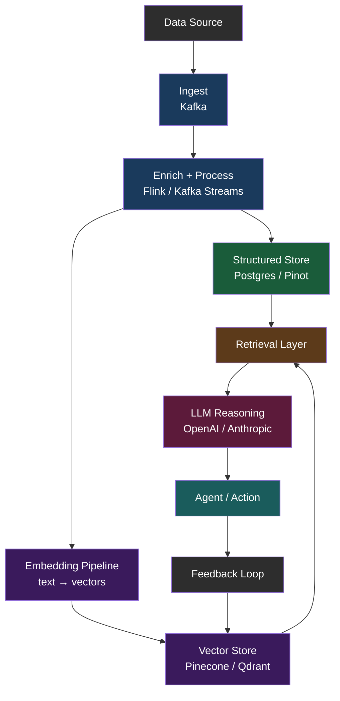

# Architecture Diagrams — Day 01

## Traditional Pipeline vs AI-Enabled System

---

## ASCII Comparison

```
TRADITIONAL DATA PIPELINE
─────────────────────────────────────────────────────────────────

  [Data Source]
       │
       ▼
  [Ingest Layer]        ← Kafka / Fivetran / Airbyte
       │
       ▼
  [Transform Layer]     ← Spark / dbt / SQL
       │
       ▼
  [Storage Layer]       ← Snowflake / BigQuery / S3
       │
       ▼
  [Query Layer]         ← SQL / Presto / Athena
       │
       ▼
  [BI / Dashboard]      ← Tableau / Looker
       │
       ▼
  [Human reads chart]

  Trigger: SCHEDULED (cron)
  Latency: Minutes → Hours
  Consumer: Human


AI-ENABLED INTELLIGENT SYSTEM
─────────────────────────────────────────────────────────────────

  [Data Source]
       │
       ▼
  [Ingest Layer]        ← Kafka (real-time events)
       │
       ▼
  [Enrich + Process]    ← Flink / Kafka Streams
       │
       ├──────────────────────────┐
       ▼                          ▼
  [Structured Store]        [Embedding Pipeline]
  (Postgres / Pinot)         (text → vectors)
                                  │
                                  ▼
                            [Vector Store]
                            (Pinecone / Qdrant / pgvector)
                                  │
       ┌───────────────────────────┘
       ▼
  [Retrieval Layer]     ← semantic search + filters
       │
       ▼
  [LLM Reasoning]       ← OpenAI / Anthropic / local model
       │
       ▼
  [Agent / Action]      ← responds, routes, triggers workflow
       │
       ▼
  [Feedback Loop]       ← logs outcome → improves retrieval

  Trigger: EVENT-DRIVEN
  Latency: Milliseconds → Seconds
  Consumer: LLM / Agent
```

---

## Mermaid Diagram

### Traditional Pipeline


### AI-Enabled System



---

## Key Structural Differences

| Aspect | Traditional | AI-Enabled |
|--------|-------------|------------|
| Flow direction | Linear | Graph (with feedback) |
| Trigger | Time-based | Event-based |
| Storage type | Relational / columnar | Relational + vector |
| End consumer | Human | LLM / Agent |
| State | Stateless | Stateful (context) |
| Latency | Minutes–hours | Milliseconds–seconds |
