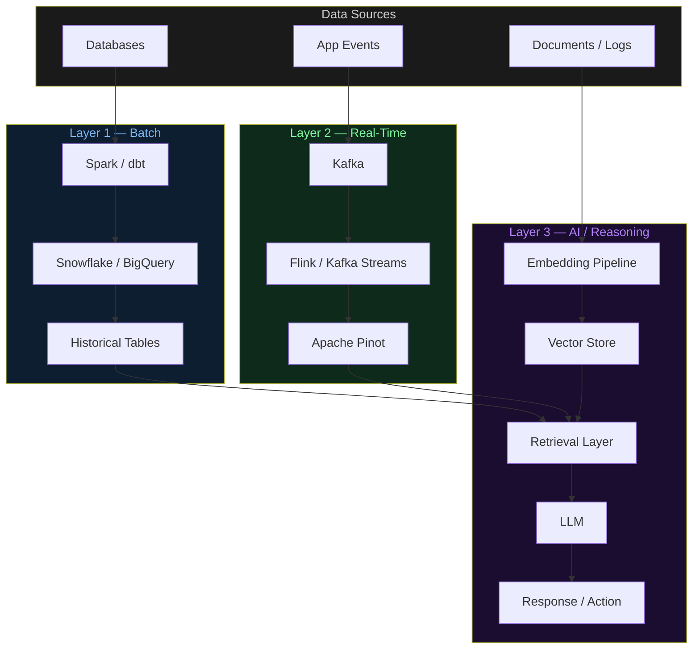
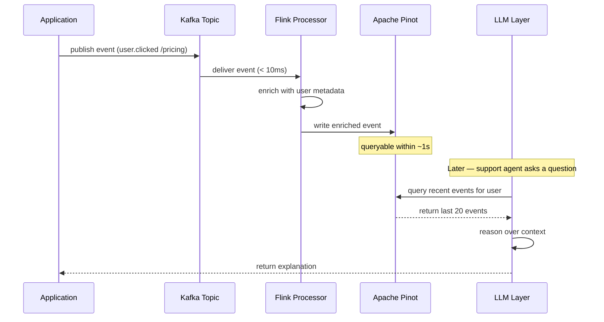

# Architecture Diagrams — Day 02

## Batch vs Real-Time vs AI Systems

---

## ASCII Diagram — Three-Layer Architecture

```
╔══════════════════════════════════════════════════════════════════════╗
║                    DATA SOURCES                                      ║
║   [App Events]  [Databases]  [Files / Logs]  [APIs]  [Documents]    ║
╚══════════╤═══════════════════════════════════════════════════════════╝
           │
           ├─────────────────────────────────────────────────────────┐
           │                                                         │
           ▼                                                         ▼
╔══════════════════════════╗                    ╔════════════════════════════╗
║   LAYER 1 — BATCH        ║                    ║  LAYER 2 — REAL-TIME       ║
║──────────────────────────║                    ║────────────────────────────║
║  Trigger: Cron / Schedule║                    ║  Trigger: Event-driven     ║
║  Latency: Hours          ║                    ║  Latency: Milliseconds     ║
║                          ║                    ║                            ║
║  [Spark / dbt]           ║                    ║  [Kafka]                   ║
║       │                  ║                    ║     │                      ║
║       ▼                  ║                    ║     ▼                      ║
║  [Snowflake / BigQuery]  ║                    ║  [Flink / Kafka Streams]   ║
║       │                  ║                    ║     │                      ║
║       ▼                  ║                    ║     ▼                      ║
║  [Historical Tables]     ║                    ║  [Apache Pinot]            ║
║  (30/60/90-day metrics)  ║                    ║  (real-time OLAP)          ║
╚══════════╤═══════════════╝                    ╚══════════╤═════════════════╝
           │                                               │
           └───────────────────┬───────────────────────────┘
                               │
                               ▼
╔══════════════════════════════════════════════════════════════════════╗
║                    LAYER 3 — AI / REASONING                          ║
║──────────────────────────────────────────────────────────────────────║
║  Trigger: On-demand (user query or event)                            ║
║  Latency: 100ms – 2s                                                 ║
║                                                                      ║
║  [Embedding Pipeline]  →  [Vector Store (Pinecone / Qdrant)]        ║
║                                    │                                 ║
║  [Structured Query (Pinot/SQL)] ───┤                                 ║
║                                    ▼                                 ║
║                          [Retrieval Layer]                           ║
║                                    │                                 ║
║                                    ▼                                 ║
║                          [LLM (GPT-4o / Claude)]                    ║
║                                    │                                 ║
║                                    ▼                                 ║
║                     [Response / Decision / Action]                   ║
╚══════════════════════════════════════════════════════════════════════╝


FLOW SUMMARY
────────────────────────────────────────────────────────────────────────
Batch Layer    → Historical aggregations, feature tables, cohort data
Real-Time Layer → Fresh events, enriched streams, low-latency queries
AI Layer       → Retrieval + reasoning over both layers
────────────────────────────────────────────────────────────────────────
```

---

## ASCII Diagram — Side-by-Side System Comparison

```
BATCH SYSTEM              REAL-TIME SYSTEM          AI SYSTEM
─────────────────         ─────────────────         ─────────────────
[Source Data]             [Event Source]            [User Query]
      │                         │                         │
      ▼                         ▼                         ▼
[Scheduled Job]           [Kafka Topic]             [Query Parser]
(runs every hour)         (continuous)              (intent + entities)
      │                         │                         │
      ▼                         ▼                         ▼
[Spark Transform]         [Stream Processor]        [Retrieval Layer]
(aggregate, clean)        (enrich, filter)          (vector + SQL)
      │                         │                         │
      ▼                         ▼                         ▼
[Write to Warehouse]      [Write to Pinot]          [Context Assembly]
(Snowflake / BQ)          (real-time OLAP)          (top-k chunks)
      │                         │                         │
      ▼                         ▼                         ▼
[SQL Query]               [Low-latency Query]       [LLM Reasoning]
      │                         │                         │
      ▼                         ▼                         ▼
[Dashboard / Report]      [Alert / Live UI]         [Generated Response]

Trigger:  CRON             EVENT                     ON-DEMAND
Latency:  HOURS            MILLISECONDS              100ms–2s
Output:   TABLE/CHART      ALERT/UPDATE              TEXT/DECISION
Consumer: HUMAN (BI)       SYSTEM/HUMAN              HUMAN/AGENT
```

---

## Mermaid Diagram — Full Layered Architecture



---

## Mermaid Diagram — Event Flow (Real-Time Path)



---

## Key Architectural Decisions

| Decision | Reason |
|----------|--------|
| Kafka as event bus | Durable, replayable, horizontally scalable. The source of truth for real-time events. |
| Flink for stream processing | Stateful operations (joins, aggregations) with exactly-once semantics. |
| Pinot for real-time OLAP | Sub-second queries on data that's seconds old. Bridges real-time and query layers. |
| Vector store for AI layer | Enables semantic retrieval — finding relevant context by meaning, not exact match. |
| LLM at the top | Reasons over pre-retrieved context. Never touches raw data directly. |
| Batch layer retained | Historical data doesn't need real-time processing. Batch is cheaper and simpler for it. |
