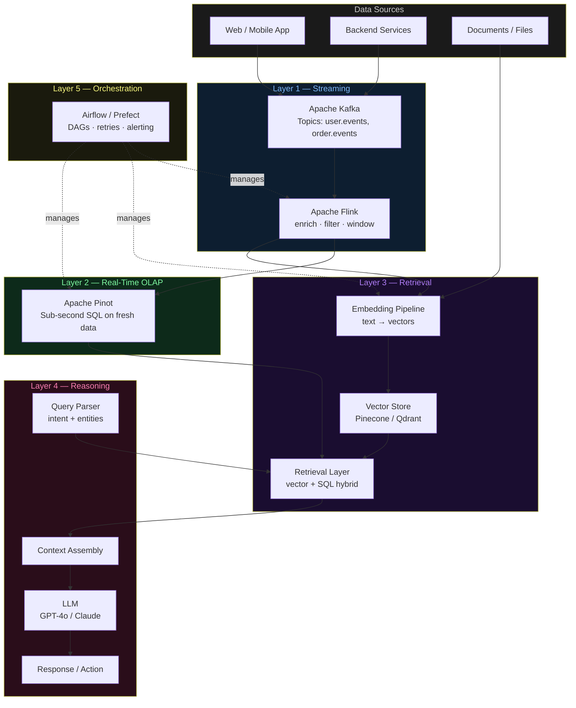
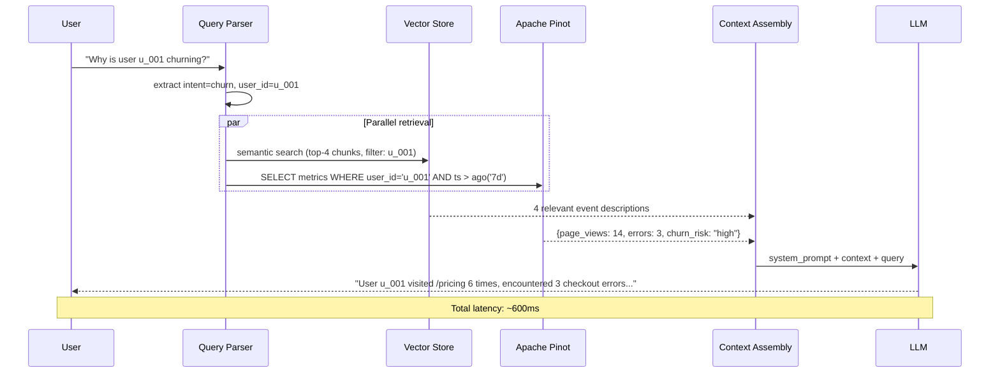

# Architecture Diagrams — Day 03: The New Stack

---

## ASCII Diagram — Full Stack (Write + Read Paths)

```
╔══════════════════════════════════════════════════════════════════════════════╗
║                          DATA SOURCES                                        ║
║         [Web App]    [Mobile App]    [Backend Services]    [Docs/Files]      ║
╚═══════════╤══════════════╤═══════════════════╤══════════════════╤════════════╝
            │              │                   │                  │
            └──────────────┴───────────────────┘                  │
                           │                                       │
                           ▼                                       ▼
╔══════════════════════════════════════╗      ╔════════════════════════════════╗
║  LAYER 1 — STREAMING                 ║      ║  EMBEDDING PIPELINE            ║
║──────────────────────────────────────║      ║────────────────────────────────║
║                                      ║      ║  Triggered by: new docs/events ║
║  ┌─────────────────────────────────┐ ║      ║                                ║
║  │  Apache Kafka                   │ ║      ║  [Text Chunker]                ║
║  │  Topics: user.events            │ ║      ║       │                        ║
║  │          order.events           │ ║      ║       ▼                        ║
║  │          system.errors          │ ║      ║  [Embedding Model]             ║
║  └──────────────┬──────────────────┘ ║      ║  (text-embedding-3-small)      ║
║                 │                    ║      ║       │                        ║
║                 ▼                    ║      ║       ▼                        ║
║  ┌─────────────────────────────────┐ ║      ║  [Vector Store]                ║
║  │  Apache Flink                   │ ║      ║  Pinecone / Qdrant / pgvector  ║
║  │  - Enrich with user metadata    │ ║      ╚════════════════════════════════╝
║  │  - Filter noise                 │ ║
║  │  - Compute session windows      │ ║
║  │  - Detect anomalies             │ ║
║  └──────────────┬──────────────────┘ ║
╚═════════════════╪════════════════════╝
                  │
                  ▼
╔═════════════════════════════════════════════════════════════════════════════╗
║  LAYER 2 — REAL-TIME OLAP (Apache Pinot)                                    ║
║─────────────────────────────────────────────────────────────────────────────║
║                                                                             ║
║  Ingests from Kafka → builds columnar indexes → serves SQL in <100ms        ║
║                                                                             ║
║  Tables:  user_events_realtime   (last 7 days, hot)                         ║
║           user_events_offline    (historical, cold)                         ║
║           session_metrics        (aggregated per session)                   ║
║                                                                             ║
║  Query example:                                                             ║
║  SELECT user_id, COUNT(*) as errors                                         ║
║  FROM user_events_realtime                                                  ║
║  WHERE event='error' AND ts > ago('7d')                                     ║
║  GROUP BY user_id ORDER BY errors DESC LIMIT 10                             ║
╚═════════════════════════════════════════════════════════════════════════════╝
                  │
                  │  ◄─────────────────────────────────────────────────────┐
                  ▼                                                         │
╔═════════════════════════════════════════════════════════════════════════════╗
║  LAYER 3 — RETRIEVAL                                                        ║
║─────────────────────────────────────────────────────────────────────────────║
║                                                                             ║
║  [User Query] → [Query Parser] → [Query Embedder]                           ║
║                                        │                                   ║
║                    ┌───────────────────┤                                   ║
║                    ▼                   ▼                                   ║
║             [Vector Search]     [Pinot SQL Query]                          ║
║             (semantic top-k)    (structured metrics)                       ║
║                    │                   │                                   ║
║                    └─────────┬─────────┘                                   ║
║                              ▼                                             ║
║                    [Context Assembly]                                      ║
║                    (ranked, deduplicated, token-budgeted)                  ║
╚══════════════════════════════╪══════════════════════════════════════════════╝
                               │
                               ▼
╔═════════════════════════════════════════════════════════════════════════════╗
║  LAYER 4 — REASONING (LLM + Agents)                                         ║
║─────────────────────────────────────────────────────────────────────────────║
║                                                                             ║
║  [System Prompt] + [Retrieved Context] + [User Query]                       ║
║                              │                                             ║
║                              ▼                                             ║
║                    [LLM: GPT-4o / Claude / local]                          ║
║                              │                                             ║
║              ┌───────────────┼───────────────┐                             ║
║              ▼               ▼               ▼                             ║
║       [Text Response]  [JSON Output]  [Tool Call]                          ║
║                                           │                                ║
║                                           ▼                                ║
║                                    [Agent executes tool]                   ║
║                                    → SQL query                             ║
║                                    → API call                              ║
║                                    → Vector search                         ║
╚═════════════════════════════════════════════════════════════════════════════╝

╔═════════════════════════════════════════════════════════════════════════════╗
║  LAYER 5 — ORCHESTRATION (Airflow / Prefect / Dagster)                      ║
║─────────────────────────────────────────────────────────────────────────────║
║                                                                             ║
║  Manages:  nightly_batch_features     → runs 00:00 UTC daily               ║
║            embedding_pipeline         → triggered on new document arrival  ║
║            data_quality_checks        → runs before downstream jobs        ║
║            model_eval_pipeline        → runs after each LLM config change  ║
║            pinot_segment_compaction   → runs weekly                        ║
║                                                                             ║
║  Provides: dependency graph · retry logic · SLA alerting · audit logs      ║
╚═════════════════════════════════════════════════════════════════════════════╝
```

---

## Mermaid Diagram — Full Stack Architecture



---

## Mermaid Diagram — Query Path (Read Flow)



---

## Layer Responsibility Matrix

| Layer | Reads from | Writes to | Latency | Failure impact |
|-------|-----------|-----------|---------|----------------|
| Kafka | App events | Topic partitions | <10ms publish | Events lost or delayed |
| Flink | Kafka topics | Pinot, Vector pipeline | <100ms processing | Stale enrichment |
| Pinot | Kafka (via connector) | Columnar segments | <100ms query | No fresh structured data |
| Vector Store | Embedding pipeline | Index | <50ms query | No semantic retrieval |
| LLM | Context window | Response tokens | 200ms–2s | No reasoning output |
| Orchestrator | DAG definitions | Job state, logs | N/A (control plane) | Silent pipeline failures |
