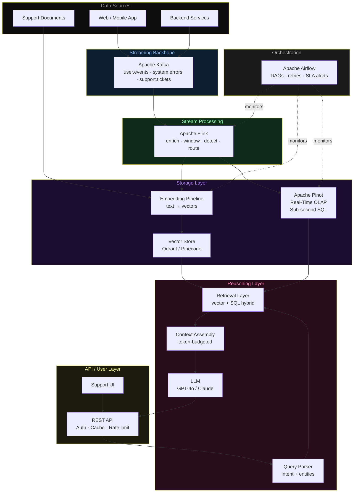
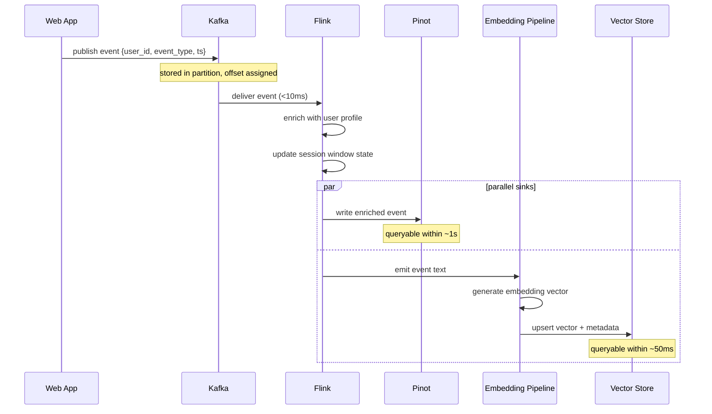
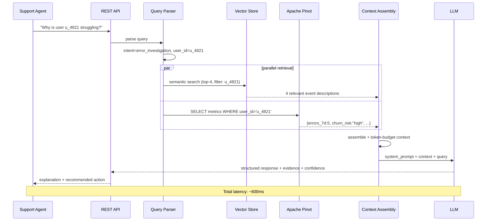

# Architecture Diagrams — Day 04: System Blueprint

---

## ASCII Diagram — Full System (Write + Read Paths)

```
╔══════════════════════════════════════════════════════════════════════════════╗
║                          DATA SOURCES                                        ║
║    [Web App]   [Mobile App]   [Backend Services]   [Support Docs]            ║
╚═══════╤════════════╤══════════════════╤═══════════════════╤══════════════════╝
        │            │                  │                   │
        └────────────┴──────────────────┘                   │
                     │  publish events                       │ ingest docs
                     ▼                                       ▼
╔════════════════════════════════════╗     ╔══════════════════════════════════╗
║  STREAMING BACKBONE                ║     ║  DOCUMENT PIPELINE               ║
║  Apache Kafka                      ║     ║  Chunker → Embedder              ║
║                                    ║     ║  (triggered by new doc arrival)  ║
║  Topics:                           ║     ╚══════════════════╤═══════════════╝
║  ├── user.events    (12 partitions)║                        │
║  ├── system.errors  (6 partitions) ║                        │ upsert vectors
║  └── support.tickets(3 partitions) ║                        ▼
╚════════════════╤═══════════════════╝     ╔══════════════════════════════════╗
                 │ consume                 ║  VECTOR STORE                    ║
                 ▼                         ║  Qdrant / Pinecone               ║
╔════════════════════════════════════╗     ║  ├── user_events namespace        ║
║  STREAM PROCESSING                 ║     ║  └── support_docs namespace       ║
║  Apache Flink                      ║     ╚══════════════════╤═══════════════╝
║                                    ║                        ▲
║  ├── Enrich (user profile lookup)  ║                        │ upsert
║  ├── Session windowing (30min gap) ║─────────────────────────┘
║  ├── Anomaly detection             ║  emit to embedding pipeline
║  └── Route to sinks                ║
╚════════════════╤═══════════════════╝
                 │ write enriched events
                 ▼
╔════════════════════════════════════════════════════════════════════════════╗
║  REAL-TIME OLAP                                                            ║
║  Apache Pinot                                                              ║
║                                                                            ║
║  Tables:                                                                   ║
║  ├── user_events_realtime   (7-day retention, hot segments)                ║
║  ├── user_metrics_daily     (2-year retention, offline segments)           ║
║  └── session_summary        (30-day retention, hybrid)                     ║
║                                                                            ║
║  Query: SELECT user_id, COUNT(*) as errors                                 ║
║         FROM user_events_realtime                                          ║
║         WHERE event='error' AND ts > ago('7d')                             ║
║         GROUP BY user_id  →  P99 latency: <100ms                          ║
╚════════════════════════════════════════════════════════════════════════════╝
         ▲                                    ▲
         │ SQL query                          │ vector search
         │                                   │
╔════════════════════════════════════════════════════════════════════════════╗
║  LLM REASONING LAYER                                                       ║
║                                                                            ║
║  [Query Parser]  →  [Retrieval Layer]  →  [Context Assembly]  →  [LLM]   ║
║                       ├── Pinot SQL                                        ║
║                       └── Vector search                                    ║
║                                                                            ║
║  Output: text response · JSON · tool call · confidence score               ║
╚════════════════════════════════════════════════════════════════════════════╝
         ▲
         │ query
╔════════════════════════════════════════════════════════════════════════════╗
║  API / USER LAYER                                                          ║
║  REST API · WebSocket · Support UI                                         ║
║  Auth · Rate limiting · Response caching                                   ║
╚════════════════════════════════════════════════════════════════════════════╝

╔════════════════════════════════════════════════════════════════════════════╗
║  ORCHESTRATION (cross-cutting)                                             ║
║  Apache Airflow                                                            ║
║  DAGs: nightly_feature_compute · embedding_refresh · data_quality_checks  ║
║        model_eval · pinot_compaction                                       ║
╚════════════════════════════════════════════════════════════════════════════╝


WRITE PATH (event ingestion):
  App → Kafka → Flink → Pinot (structured, queryable in ~1s)
                      → Embedding Pipeline → Vector Store (semantic, queryable in ~50ms)

READ PATH (query flow):
  User → API → Query Parser → [Pinot SQL + Vector Search] → Context Assembly
       → LLM → Response (total: ~600ms)
```

---

## Mermaid Diagram — Full System Architecture



---

## Mermaid Diagram — Write Path Sequence



---

## Mermaid Diagram — Read Path Sequence



---

## Component Latency Budget

```
Query received by API                    t=0ms
├── Query parsing                        t=5ms
├── Parallel retrieval starts            t=10ms
│   ├── Vector search (Qdrant)           t=60ms   (+50ms)
│   └── Pinot SQL query                  t=80ms   (+70ms)
├── Context assembly                     t=90ms   (+10ms)
├── LLM call (GPT-4o-mini)              t=550ms  (+460ms)
└── Response serialization + return      t=600ms  (+50ms)

Total: ~600ms P50 | ~900ms P99
```
