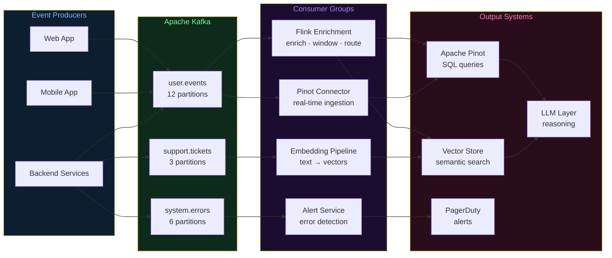
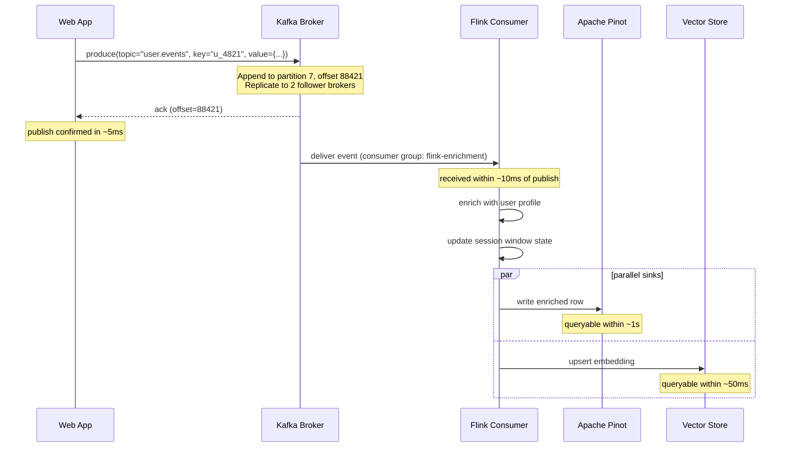

# Architecture Diagrams — Day 05: Event-Driven Systems with Kafka

---

## ASCII Diagram — Event Flow Architecture

```
╔══════════════════════════════════════════════════════════════════════════════╗
║                         EVENT PRODUCERS                                      ║
║   [Web App]    [Mobile App]    [Backend Services]    [Payment System]        ║
╚═══════╤═══════════════╤══════════════════╤═══════════════════╤══════════════╝
        │               │                  │                   │
        │  publish(key, value)              │                   │
        └───────────────┴──────────────────┴───────────────────┘
                                    │
                                    ▼
╔══════════════════════════════════════════════════════════════════════════════╗
║  APACHE KAFKA                                                                ║
║──────────────────────────────────────────────────────────────────────────────║
║                                                                              ║
║  Topic: user.events (12 partitions, keyed by user_id)                       ║
║  ┌─────────────────────────────────────────────────────────────────────┐    ║
║  │ Partition 0: [off=0: evt_A] [off=1: evt_D] [off=2: evt_G] ...      │    ║
║  │ Partition 1: [off=0: evt_B] [off=1: evt_E] [off=2: evt_H] ...      │    ║
║  │ Partition 2: [off=0: evt_C] [off=1: evt_F] [off=2: evt_I] ...      │    ║
║  └─────────────────────────────────────────────────────────────────────┘    ║
║                                                                              ║
║  Topic: system.errors (6 partitions)                                        ║
║  Topic: support.tickets (3 partitions)                                      ║
║                                                                              ║
║  Retention: configurable (default 7 days)                                   ║
║  Replication factor: 3 (for fault tolerance)                                ║
╚══════════════════════════════╤═══════════════════════════════════════════════╝
                               │
              ┌────────────────┼────────────────┐
              │                │                │
              ▼                ▼                ▼
╔═════════════════╗  ╔══════════════════╗  ╔═════════════════════╗
║ CONSUMER GROUP  ║  ║  CONSUMER GROUP  ║  ║  CONSUMER GROUP     ║
║ flink-enrichment║  ║  pinot-connector ║  ║  alert-service      ║
║─────────────────║  ║──────────────────║  ║─────────────────────║
║ Reads all       ║  ║ Reads all        ║  ║ Reads error events  ║
║ partitions      ║  ║ partitions       ║  ║ only                ║
║                 ║  ║                  ║  ║                     ║
║ Enriches events ║  ║ Writes to Pinot  ║  ║ Fires PagerDuty     ║
║ Routes to sinks ║  ║ real-time table  ║  ║ alerts              ║
╚════════╤════════╝  ╚══════════════════╝  ╚═════════════════════╝
         │
         ├──────────────────────────────────┐
         ▼                                  ▼
╔═════════════════════╗          ╔══════════════════════════╗
║  APACHE PINOT       ║          ║  EMBEDDING PIPELINE      ║
║  Real-Time OLAP     ║          ║  text → vectors          ║
║  SQL in <100ms      ║          ║  → Vector Store (Qdrant) ║
╚═════════════════════╝          ╚══════════════════════════╝
         │                                  │
         └──────────────────┬───────────────┘
                            ▼
                   ╔════════════════╗
                   ║  LLM LAYER     ║
                   ║  Retrieval +   ║
                   ║  Reasoning     ║
                   ╚════════════════╝


KEY PROPERTIES:
  Producers and consumers are fully decoupled
  Multiple consumer groups read the same topic independently
  Each consumer tracks its own offset (position in the log)
  Events are retained for replay — consumers can re-read history
  Partition key (user_id) guarantees ordering per user
```

---

## ASCII Diagram — Partition + Offset Model

```
Topic: user.events
─────────────────────────────────────────────────────────────────────

Partition 0 (users hashed to 0):
  offset: 0          1          2          3          4
          [u_001:pv] [u_001:clk][u_004:err][u_001:pur][u_004:pv ]
                                                ↑
                                    Consumer A offset = 4
                                    (next read: offset 4)

Partition 1 (users hashed to 1):
  offset: 0          1          2          3
          [u_002:pv] [u_002:err][u_002:pur][u_002:lgout]
                         ↑
                Consumer B offset = 2
                (next read: offset 2)

Partition 2 (users hashed to 2):
  offset: 0          1          2
          [u_003:sgn][u_003:pv] [u_003:err]
                                      ↑
                              Consumer C offset = 3
                              (next read: nothing yet)

Legend: pv=page_view, clk=click, err=error, pur=purchase, sgn=signup, lgout=logout
```

---

## Mermaid Diagram — Event-Driven Architecture



---

## Mermaid Diagram — Event Lifecycle


