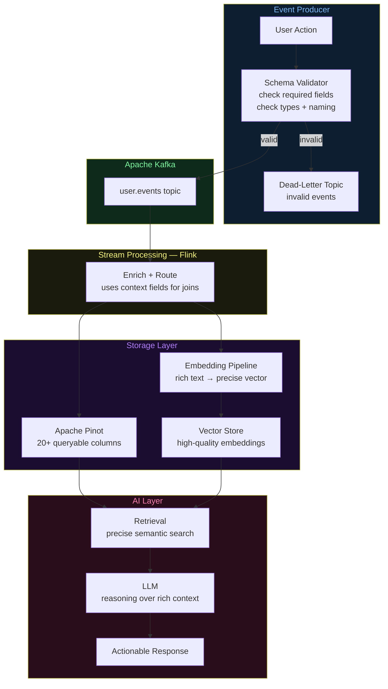

# Architecture Diagrams — Day 06: Event Schema Design

---

## ASCII Diagram — Schema Flow Through the System

```
╔══════════════════════════════════════════════════════════════════════════════╗
║  USER ACTION                                                                 ║
║  "User clicks Upgrade Plan button on /pricing page (mobile, free plan)"     ║
╚══════════════════════════════╤═══════════════════════════════════════════════╝
                               │
                               ▼
╔══════════════════════════════════════════════════════════════════════════════╗
║  SCHEMA VALIDATION (Producer side)                                           ║
║                                                                              ║
║  Required fields present?  ✓ event_id, event_type, user_id, ts              ║
║  Types correct?            ✓ ts is ISO 8601, user_id is string              ║
║  Naming consistent?        ✓ snake_case, namespaced event_type              ║
║  Schema version set?       ✓ schema_version: "1.0"                          ║
║                                                                              ║
║  PASS → publish to Kafka                                                     ║
║  FAIL → log error, send to dead-letter topic                                 ║
╚══════════════════════════════╤═══════════════════════════════════════════════╝
                               │
                               ▼
╔══════════════════════════════════════════════════════════════════════════════╗
║  APACHE KAFKA                                                                ║
║  Topic: user.events                                                          ║
║                                                                              ║
║  WEAK SCHEMA EVENT:                                                          ║
║  {"uid":"u_4821","evt":"click","t":1714225921}                               ║
║                                                                              ║
║  STRONG SCHEMA EVENT:                                                        ║
║  {"event_id":"evt_a1b2","schema_version":"1.0","event_type":"ui.button_click"║
║   "user_id":"u_4821","session_id":"sess_9x8y","ts":"2026-04-27T14:32:01Z",  ║
║   "context":{"page":"/pricing","element_id":"cta_upgrade_plan",...},        ║
║   "device":{"type":"mobile","os":"iOS 17"},"user_properties":{...}}         ║
╚══════════════════════════════╤═══════════════════════════════════════════════╝
                               │
                               ▼
╔══════════════════════════════════════════════════════════════════════════════╗
║  STREAM PROCESSING (Flink)                                                   ║
║                                                                              ║
║  WEAK SCHEMA:   Cannot enrich — no context to join on                       ║
║  STRONG SCHEMA: Enriches with real-time user metrics, routes correctly      ║
╚══════════════════════════════╤═══════════════════════════════════════════════╝
                               │
              ┌────────────────┴────────────────┐
              ▼                                 ▼
╔═════════════════════════╗         ╔═══════════════════════════════════════╗
║  APACHE PINOT           ║         ║  EMBEDDING PIPELINE                   ║
║                         ║         ║                                       ║
║  WEAK SCHEMA:           ║         ║  WEAK SCHEMA TEXT:                    ║
║  user_id | event | ts   ║         ║  "User u_4821 clicked at 14:32"       ║
║  (3 columns, no context)║         ║  → generic vector, poor retrieval     ║
║                         ║         ║                                       ║
║  STRONG SCHEMA:         ║         ║  STRONG SCHEMA TEXT:                  ║
║  20+ columns including  ║         ║  "User u_4821 (free, mobile) clicked  ║
║  plan, device, page,    ║         ║   Upgrade Plan on /pricing..."        ║
║  element, segment, etc. ║         ║  → specific vector, precise retrieval ║
╚═════════════════════════╝         ╚═══════════════════════════════════════╝
              │                                 │
              └────────────────┬────────────────┘
                               ▼
╔══════════════════════════════════════════════════════════════════════════════╗
║  LLM REASONING LAYER                                                         ║
║                                                                              ║
║  WEAK SCHEMA CONTEXT:                                                        ║
║  "User u_4821 clicked at 14:32. User u_4821 clicked at 14:35."              ║
║  LLM: "Insufficient context to determine user intent."                       ║
║                                                                              ║
║  STRONG SCHEMA CONTEXT:                                                      ║
║  "User u_4821 (free plan, mobile, at_risk segment) clicked 'Upgrade to Pro' ║
║   on /pricing at 14:32 after visiting /pricing 3 times this session."       ║
║  LLM: "User shows strong upgrade intent. Recommend immediate offer trigger." ║
╚══════════════════════════════════════════════════════════════════════════════╝
```

---

## ASCII Diagram — Schema Component Map

```
GOOD EVENT SCHEMA — COMPONENT BREAKDOWN
────────────────────────────────────────────────────────────────────────────

{
  ┌─ IDENTIFIERS ──────────────────────────────────────────────────────────┐
  │  "event_id":       "evt_a1b2c3d4"    ← globally unique, deduplication  │
  │  "user_id":        "u_4821"          ← who, enables user-level filter   │
  │  "session_id":     "sess_9x8y7z"    ← groups events into sessions      │
  └────────────────────────────────────────────────────────────────────────┘

  ┌─ CLASSIFICATION ────────────────────────────────────────────────────────┐
  │  "schema_version": "1.0"             ← enables safe schema evolution    │
  │  "event_type":     "ui.button_click" ← namespaced, filterable           │
  │  "ts":             "2026-04-27T..."  ← ISO 8601 UTC, millisecond prec.  │
  └────────────────────────────────────────────────────────────────────────┘

  ┌─ CONTEXT (what happened, where) ───────────────────────────────────────┐
  │  "context": {                                                           │
  │    "page":         "/pricing"        ← where the event occurred        │
  │    "element_id":   "cta_upgrade"     ← what was interacted with        │
  │    "element_text": "Upgrade to Pro"  ← human-readable label            │
  │    "referrer":     "/home"           ← where user came from            │
  │  }                                                                      │
  └────────────────────────────────────────────────────────────────────────┘

  ┌─ DEVICE (how it happened) ──────────────────────────────────────────────┐
  │  "device": {                                                            │
  │    "type":    "mobile"               ← mobile vs desktop behavior      │
  │    "os":      "iOS 17"               ← OS-specific issues              │
  │    "browser": "Safari"               ← browser-specific issues         │
  │  }                                                                      │
  └────────────────────────────────────────────────────────────────────────┘

  ┌─ USER PROPERTIES (state at event time) ────────────────────────────────┐
  │  "user_properties": {                                                   │
  │    "plan":            "free"         ← plan at time of event           │
  │    "country":         "US"           ← geography                       │
  │    "signup_days_ago": 45             ← user lifecycle stage            │
  │    "segment":         "at_risk"      ← ML-derived segment              │
  │  }                                                                      │
  └────────────────────────────────────────────────────────────────────────┘
}
```

---

## Mermaid Diagram — Schema Flow Through System



---

## Schema Evolution — Safe vs Breaking Changes

```
SCHEMA VERSION HISTORY
────────────────────────────────────────────────────────────────────────

v1.0 (initial)
  Required: event_id, event_type, user_id, ts
  Optional: context, device

v1.1 (safe — additive change)
  + Added optional field: device.app_version
  + Added optional field: user_properties.signup_days_ago
  ✅ All v1.0 consumers still work (new fields are optional)

v1.2 (safe — additive change)
  + Added optional field: context.ab_test_variant
  ✅ All v1.0 and v1.1 consumers still work

v2.0 (breaking — requires migration)
  ~ Renamed user_id → userId          ← BREAKING: all consumers must update
  ~ Changed ts format: ISO → Unix     ← BREAKING: all consumers must update
  ❌ All v1.x consumers break silently without schema_version check

RULE: Never rename or remove required fields without a major version bump
      and a coordinated consumer migration.
```
