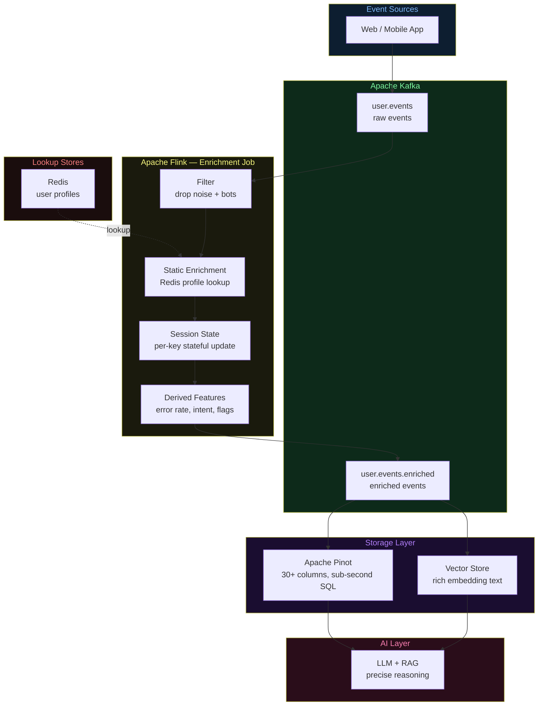
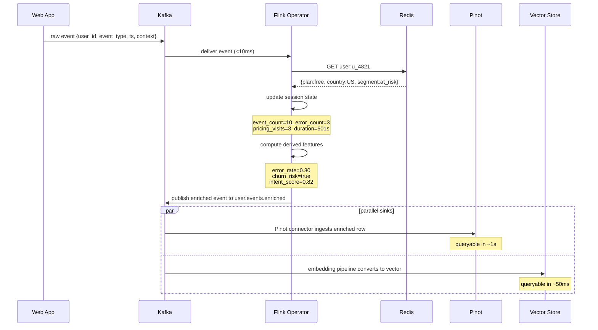

# Architecture Diagrams — Day 07: Stream Processing (Enrichment Layer)

---

## ASCII Diagram — Raw vs Enriched Pipeline

```
RAW PIPELINE (no stream processing)
─────────────────────────────────────────────────────────────────────────────

[Web App]
    │ publish raw event
    ▼
[Kafka: user.events]
    │ consume raw
    ▼
[Pinot / Vector Store]
    │ stores: event_id, event_type, user_id, ts, context
    │ missing: plan, segment, session state, error rate, intent score
    ▼
[LLM Query]
    │ retrieves: "User u_4821 clicked at 14:32"
    ▼
[LLM Response]
    "Insufficient context to determine user intent."


ENRICHED PIPELINE (with stream processing)
─────────────────────────────────────────────────────────────────────────────

[Web App]
    │ publish raw event
    ▼
[Kafka: user.events]
    │ consume raw
    ▼
╔══════════════════════════════════════════════════════════════════════════╗
║  FLINK ENRICHMENT JOB                                                    ║
║                                                                          ║
║  Step 1: Filter                                                          ║
║    Drop heartbeats, health checks, bot traffic                           ║
║                                                                          ║
║  Step 2: Static Enrichment                                               ║
║    Redis GET user:{user_id}                                              ║
║    → plan, country, segment, lifetime_orders                             ║
║                                                                          ║
║  Step 3: Session State Update (per-key state, keyed by session_id)      ║
║    → session_event_count += 1                                            ║
║    → session_error_count += 1 (if error event)                          ║
║    → session_pages_visited.append(page)                                  ║
║    → pricing_page_visits += 1 (if page == /pricing)                     ║
║    → session_duration_s = now - session_start_ts                        ║
║                                                                          ║
║  Step 4: Derived Feature Computation                                     ║
║    → session_error_rate = errors / total_events                          ║
║    → churn_risk_flag = error_rate >= 0.3 AND plan == "free"             ║
║    → upgrade_intent_score = f(pricing_visits, plan, segment)            ║
║    → is_high_value = lifetime_orders > 2 AND session_duration > 300s   ║
║                                                                          ║
║  Step 5: Route to Sinks                                                  ║
║    → Sink A: Kafka topic "user.events.enriched" → Pinot connector       ║
║    → Sink B: Kafka topic "user.events.enriched" → Embedding pipeline    ║
╚══════════════════════════════════════════════════════════════════════════╝
    │
    ├──────────────────────────────────────────────┐
    ▼                                              ▼
[Pinot: user_events_enriched]              [Vector Store]
    │ 30+ columns, sub-second SQL           │ rich embedding text
    │ churn_risk_flag, error_rate, etc.     │ precise semantic retrieval
    ▼                                              ▼
[LLM Query]  ←──────────────────────────────────────┘
    │ retrieves: "User u_4821 (free, at_risk) hit 3 errors,
    │            30% error rate, visited /pricing 3x. Churn: TRUE."
    ▼
[LLM Response]
    "User u_4821 is at high churn risk. 3 checkout errors blocked
     upgrade intent. Recommend: fix checkout + send upgrade offer."
```

---

## ASCII Diagram — Enrichment Operator Detail

```
FLINK ENRICHMENT OPERATOR (KeyedProcessFunction, keyed by user_id)
─────────────────────────────────────────────────────────────────────────────

Incoming event:
  { event_id, event_type, user_id, session_id, ts, context }
                    │
                    ▼
  ┌─────────────────────────────────────────────────────────┐
  │  STATIC ENRICHMENT                                       │
  │  Redis GET user:{user_id}                               │
  │  Latency: < 5ms                                         │
  │  Result: { plan, country, segment, lifetime_orders }    │
  └─────────────────────────────────────────────────────────┘
                    │
                    ▼
  ┌─────────────────────────────────────────────────────────┐
  │  SESSION STATE (Flink ValueState, per session_id)       │
  │  Read current state for this session                    │
  │  Update:                                                │
  │    event_count    += 1                                  │
  │    error_count    += 1  (if event_type contains error)  │
  │    pages_visited.append(context.page)                   │
  │    pricing_visits += 1  (if page == /pricing)           │
  │    duration_s      = now - session_start_ts             │
  │  Write updated state back                               │
  └─────────────────────────────────────────────────────────┘
                    │
                    ▼
  ┌─────────────────────────────────────────────────────────┐
  │  DERIVED FEATURES                                        │
  │  Computed from static + session state                   │
  │                                                         │
  │  error_rate     = error_count / event_count             │
  │  churn_risk     = error_rate >= 0.3 AND plan == "free"  │
  │  intent_score   = pricing_visits * 0.25 +               │
  │                   (0.3 if segment == "at_risk" else 0)  │
  │  high_value     = lifetime_orders > 2 AND duration > 300│
  └─────────────────────────────────────────────────────────┘
                    │
                    ▼
  Enriched event:
  { ...original fields...,
    user_profile, session_state, derived_features }
```

---

## Mermaid Diagram — Stream Processing Architecture



---

## Mermaid Diagram — Event Transformation Sequence



---

## Enrichment Impact on Downstream Systems

```
PINOT TABLE COLUMNS
─────────────────────────────────────────────────────────────────────────────
Without enrichment (raw):
  event_id | event_type | user_id | session_id | ts | page | error_code
  (7 columns — limited filtering, no behavioral context)

With enrichment:
  event_id | event_type | user_id | session_id | ts | page | error_code
  | plan | country | segment | lifetime_orders
  | session_event_count | session_error_count | pricing_page_visits | session_duration_s
  | session_error_rate | churn_risk_flag | upgrade_intent_score | is_high_value_session
  (20+ columns — rich filtering, full behavioral context)

EXAMPLE QUERY (only possible with enrichment):
  SELECT user_id, session_error_rate, upgrade_intent_score
  FROM user_events_enriched
  WHERE churn_risk_flag = true
    AND upgrade_intent_score > 0.5
    AND ts > ago('1h')
  ORDER BY upgrade_intent_score DESC
  LIMIT 10
  → "Users who are at churn risk but show upgrade intent — act now"

VECTOR STORE EMBEDDING QUALITY
─────────────────────────────────────────────────────────────────────────────
Raw text:     "User u_4821 hit an error at 14:35."
              → generic vector, matches everything weakly

Enriched text: "User u_4821 (free, US, at_risk) hit 500 error on /checkout.
               Session: 10 events, 3 errors (30% rate), /pricing visited 3x.
               Churn risk: TRUE. Intent score: 0.41."
              → specific vector, matches "checkout errors", "churn risk",
                "free plan frustration" queries precisely
```
