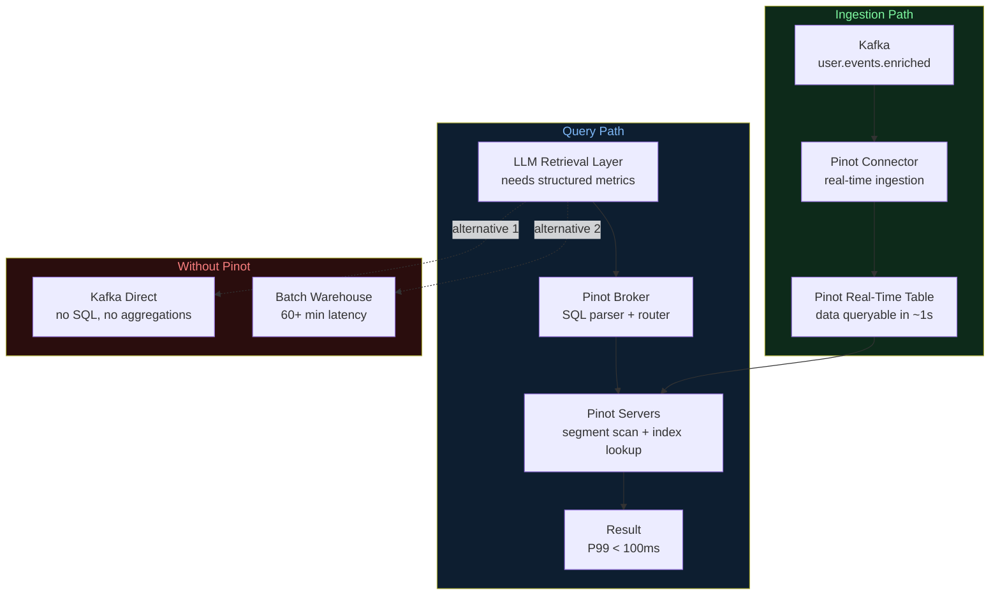

# Architecture Diagrams — Day 08: Real-Time Analytics with Apache Pinot

---

## ASCII Diagram — Pinot in the Full Stack

```
╔══════════════════════════════════════════════════════════════════════════════╗
║  DATA SOURCES                                                                ║
║  [Web App]  [Mobile App]  [Backend Services]                                 ║
╚══════════════════════════╤═══════════════════════════════════════════════════╝
                           │ publish enriched events
                           ▼
╔══════════════════════════════════════════════════════════════════════════════╗
║  APACHE KAFKA                                                                ║
║  Topic: user.events.enriched (12 partitions)                                ║
║  Contains: event fields + user_profile + session_state + derived_features   ║
╚══════════════════════════╤═══════════════════════════════════════════════════╝
                           │
              ┌────────────┴────────────┐
              │                         │
              ▼                         ▼
╔═════════════════════════╗   ╔══════════════════════════════════════════════╗
║  PINOT REAL-TIME        ║   ║  EMBEDDING PIPELINE                          ║
║  INGESTION              ║   ║  text → vectors → Vector Store               ║
║                         ║   ╚══════════════════════════════════════════════╝
║  Kafka connector reads  ║
║  from all 12 partitions ║
║  Writes to in-memory    ║
║  mutable segments       ║
║  Data queryable: ~1s    ║
╚═════════════════════════╝
              │
              ▼
╔══════════════════════════════════════════════════════════════════════════════╗
║  APACHE PINOT — REAL-TIME OLAP                                               ║
║──────────────────────────────────────────────────────────────────────────────║
║                                                                              ║
║  Table: user_events_realtime                                                 ║
║  ┌──────────────────────────────────────────────────────────────────────┐   ║
║  │ Columns (20+):                                                        │   ║
║  │ event_id | event_type | user_id | session_id | ts | page | error_code│   ║
║  │ plan | country | segment | lifetime_orders                           │   ║
║  │ session_events | session_errors | pricing_visits | duration_s        │   ║
║  │ error_rate | churn_risk | intent_score | is_high_value               │   ║
║  └──────────────────────────────────────────────────────────────────────┘   ║
║                                                                              ║
║  Indexes: inverted (plan, segment, churn_risk) + range (ts, error_rate)     ║
║  Retention: 7 days (real-time) | 2 years (offline)                          ║
║  Query P99: < 100ms                                                          ║
╚══════════════════════════╤═══════════════════════════════════════════════════╝
                           │
              ┌────────────┴────────────┐
              │                         │
              ▼                         ▼
╔═════════════════════════╗   ╔══════════════════════════════════════════════╗
║  PINOT BROKER           ║   ║  QUERY CONSUMERS                             ║
║  SQL query interface    ║   ║                                              ║
║  Routes to servers      ║   ║  ├── LLM Retrieval Layer                    ║
║  Merges results         ║   ║  │   "SELECT metrics WHERE user_id=..."      ║
║  P99 < 100ms            ║   ║  │                                           ║
╚═════════════════════════╝   ║  ├── Support Agent UI                       ║
                              ║  │   "Show me at-risk users"                 ║
                              ║  │                                           ║
                              ║  └── Real-Time Dashboards                   ║
                              ║      "Live error rate by page"               ║
                              ╚══════════════════════════════════════════════╝


WITH PINOT:
  Query: "errors for u_4821 last hour"
  Latency: ~68ms
  Data age: ~1 second

WITHOUT PINOT:
  Option A: Query Kafka directly → no SQL, no aggregations, high complexity
  Option B: Wait for batch job → 60+ minutes latency, stale data
```

---

## ASCII Diagram — Pinot Internal Architecture

```
PINOT CLUSTER COMPONENTS
─────────────────────────────────────────────────────────────────────────────

[Client / LLM Layer]
    │ SQL query
    ▼
[Pinot Broker]
    │ parse SQL
    │ identify relevant segments (time-based pruning)
    │ scatter query to servers
    ▼
[Pinot Server 1]          [Pinot Server 2]          [Pinot Server 3]
  Segments: p0-p3           Segments: p4-p7           Segments: p8-p11
  ├── Real-time seg         ├── Real-time seg         ├── Real-time seg
  │   (in-memory,           │   (in-memory,           │   (in-memory,
  │    mutable)             │    mutable)             │    mutable)
  └── Offline segs          └── Offline segs          └── Offline segs
      (deep storage,            (deep storage,            (deep storage,
       immutable)                immutable)                immutable)
    │                           │                           │
    └───────────────────────────┴───────────────────────────┘
                                │ partial results
                                ▼
                        [Pinot Broker]
                            │ merge + sort
                            ▼
                        [Client]
                        Result in < 100ms

[Pinot Controller]
    Manages cluster metadata, segment assignments, schema registry
    Coordinates segment commits from real-time to offline
```

---

## Mermaid Diagram — Real-Time Query Flow



---

## Mermaid Diagram — Query Latency Comparison

```mermaid
sequenceDiagram
    participant LLM as LLM Layer
    participant PB as Pinot Broker
    participant PS as Pinot Server
    participant BW as Batch Warehouse
    participant KF as Kafka Direct

    Note over LLM: Query: "errors for u_4821 last hour"

    rect rgb(13, 42, 26)
        Note over LLM,PS: WITH PINOT
        LLM->>PB: SELECT COUNT(*) WHERE user_id='u_4821' AND ts > ago('1h')
        PB->>PS: scatter to relevant servers (time pruning)
        PS-->>PB: partial results from segments
        PB-->>LLM: {error_count: 3, error_rate: 0.30}
        Note over LLM: Latency: ~68ms | Data age: ~1s
    end

    rect rgb(42, 13, 13)
        Note over LLM,BW: WITHOUT PINOT — Batch Warehouse
        LLM->>BW: same query
        BW-->>LLM: result (if data was loaded in last batch run)
        Note over LLM: Latency: 10-60s | Data age: 1-24h
    end

    rect rgb(42, 13, 13)
        Note over LLM,KF: WITHOUT PINOT — Kafka Direct
        LLM->>KF: scan topic for user events
        KF-->>LLM: raw events (no aggregation possible)
        Note over LLM: No SQL, no COUNT, no GROUP BY
    end
```



---

## Pinot Table Schema — Column Types and Indexes

```
TABLE: user_events_realtime
─────────────────────────────────────────────────────────────────────────────

Column              Type        Index           Purpose
─────────────────────────────────────────────────────────────────────────────
event_id            STRING      none            deduplication
event_type          STRING      inverted        filter by event category
user_id             STRING      inverted        filter by user
session_id          STRING      inverted        filter by session
ts                  TIMESTAMP   sorted (time)   time-based pruning ← KEY
page                STRING      inverted        filter by page
error_code          INT         range           filter by error code

plan                STRING      inverted        filter by plan tier
country             STRING      inverted        filter by geography
segment             STRING      inverted        filter by ML segment
lifetime_orders     INT         range           filter by order history

session_events      INT         range           filter by session size
session_errors      INT         range           filter by error count
pricing_visits      INT         range           filter by intent signal
duration_s          INT         range           filter by session length

error_rate          DOUBLE      range           filter by error rate
churn_risk          BOOLEAN     inverted        filter at-risk users ← KEY
intent_score        DOUBLE      range           filter by intent ← KEY
is_high_value       BOOLEAN     inverted        filter high-value sessions
─────────────────────────────────────────────────────────────────────────────

Most selective filters (fastest queries):
  churn_risk = true AND ts > ago('1h')
  intent_score > 0.7 AND plan = 'free'
  user_id = 'u_4821' AND ts > ago('7d')
```
