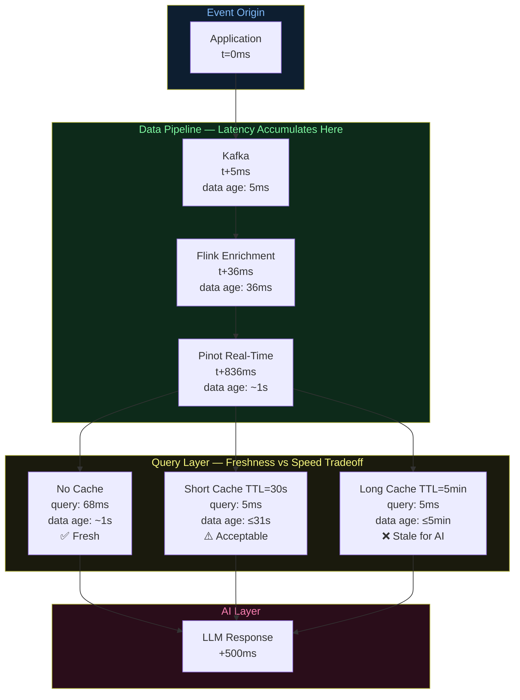
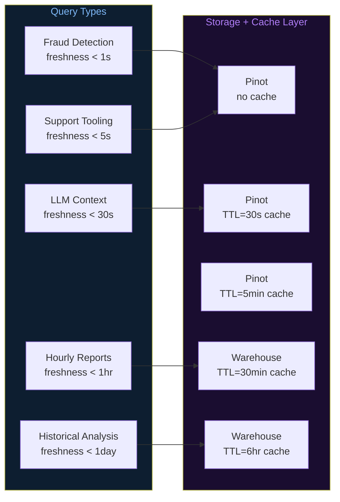

# Architecture Diagrams — Day 09: Latency vs Freshness Tradeoff

---

## ASCII Diagram — Pipeline Delays (Where Latency Accumulates)

```
EVENT OCCURS IN APPLICATION
t = 0ms
    │
    │  +5ms   (network + Kafka broker write)
    ▼
╔══════════════════════════════════════════════════════════════╗
║  KAFKA TOPIC: user.events                                    ║
║  Event stored at offset N                                    ║
║  Data age: ~5ms                                              ║
╚══════════════════════════════════════════════════════════════╝
    │
    │  +15ms  (Flink consumer poll interval)
    │  +8ms   (Redis lookup — static enrichment)
    │  +2ms   (session state update)
    │  +1ms   (derived feature computation)
    │  +5ms   (Kafka write — enriched topic)
    ▼
╔══════════════════════════════════════════════════════════════╗
║  FLINK OUTPUT: user.events.enriched                          ║
║  Enriched event in Kafka                                     ║
║  Data age: ~36ms                                             ║
╚══════════════════════════════════════════════════════════════╝
    │
    │  +800ms  (Pinot segment build + commit interval)
    │           ← THIS IS THE BIGGEST FRESHNESS BOTTLENECK
    ▼
╔══════════════════════════════════════════════════════════════╗
║  PINOT REAL-TIME TABLE: user_events_realtime                 ║
║  Event queryable via SQL                                     ║
║  Data age: ~836ms (~1 second)                                ║
╚══════════════════════════════════════════════════════════════╝
    │
    │  +68ms   (Pinot query execution — P99)
    │  OR
    │  +0ms    (cache hit, TTL not expired)
    │  +stale  (cache hit, data may be minutes old)
    ▼
╔══════════════════════════════════════════════════════════════╗
║  QUERY RESULT                                                ║
║  Fresh path:  data age ~904ms, query time ~68ms              ║
║  Cached path: data age ~5min,  query time ~5ms               ║
╚══════════════════════════════════════════════════════════════╝
    │
    │  +500ms  (LLM call — GPT-4o-mini)
    ▼
╔══════════════════════════════════════════════════════════════╗
║  AI RESPONSE                                                 ║
║  Fresh path:  total ~1.4s, data age ~1s                      ║
║  Cached path: total ~505ms, data age ~5min                   ║
╚══════════════════════════════════════════════════════════════╝


LATENCY BUDGET BREAKDOWN
─────────────────────────────────────────────────────────────────
Stage                    Latency    Cumulative    Freshness impact
─────────────────────────────────────────────────────────────────
App → Kafka              5ms        5ms           minimal
Kafka → Flink            15ms       20ms          minimal
Flink enrichment         11ms       31ms          minimal
Flink → Kafka (enr.)     5ms        36ms          minimal
Kafka → Pinot segment    800ms      836ms         ← MAJOR
Pinot query              68ms       904ms         none (read)
LLM call                 500ms      1,404ms       none (read)
─────────────────────────────────────────────────────────────────
Total (no cache):        ~1.4s      data age ~1s
Total (5min cache):      ~505ms     data age ~5min
─────────────────────────────────────────────────────────────────
```

---

## ASCII Diagram — Freshness vs Latency Spectrum

```
FRESHNESS vs QUERY LATENCY — Where Different Approaches Land
─────────────────────────────────────────────────────────────────

HIGH FRESHNESS
     │
     │  Kafka Direct Scan
     │  (data age: ~0ms, query: ~120ms, no SQL)
     │
     │  Pinot Real-Time (no cache)
     │  (data age: ~1s, query: ~68ms)  ← SWEET SPOT FOR AI
     │
     │  Pinot + Short Cache (TTL=30s)
     │  (data age: ~31s, query: ~5ms)
     │
     │  Pinot + Medium Cache (TTL=5min)
     │  (data age: ~5min, query: ~5ms)
     │
     │  Data Warehouse (batch, hourly)
     │  (data age: ~60min, query: ~2s)
     │
LOW  │  Data Warehouse (batch, daily)
FRESHNESS  (data age: ~24hr, query: ~10s)
     │
     └──────────────────────────────────────────────────────────
        FAST QUERY                              SLOW QUERY
        (low latency)                           (high latency)


AI SYSTEM REQUIREMENTS:
  Support tooling:    freshness < 5s,  query < 200ms  → Pinot no cache
  Fraud detection:    freshness < 1s,  query < 100ms  → Pinot no cache
  Weekly reports:     freshness < 1hr, query < 5s     → Warehouse + cache
  LLM context:        freshness < 30s, query < 100ms  → Pinot + short TTL
```

---

## ASCII Diagram — Consumer Lag and Freshness Degradation

```
KAFKA CONSUMER LAG — How Freshness Degrades Under Load
─────────────────────────────────────────────────────────────────

Normal operation (lag = 0):
  Kafka latest offset:   88,421
  Flink consumer offset: 88,421
  Lag: 0 messages
  Freshness: ~1 second ✅

Under load (lag building):
  Kafka latest offset:   89,500
  Flink consumer offset: 88,421
  Lag: 1,079 messages
  At 100 events/sec: ~10.8 seconds behind
  Freshness: ~12 seconds ⚠️

Severe lag (alert threshold):
  Kafka latest offset:   98,421
  Flink consumer offset: 88,421
  Lag: 10,000 messages
  At 100 events/sec: ~100 seconds behind
  Freshness: ~102 seconds ❌

MONITORING RULE:
  Alert when consumer lag > 1,000 messages (10s at 100 events/sec)
  Page when consumer lag > 10,000 messages (100s at 100 events/sec)
```

---

## Mermaid Diagram — Latency vs Freshness Architecture



---

## Mermaid Diagram — Tiered Freshness Design


