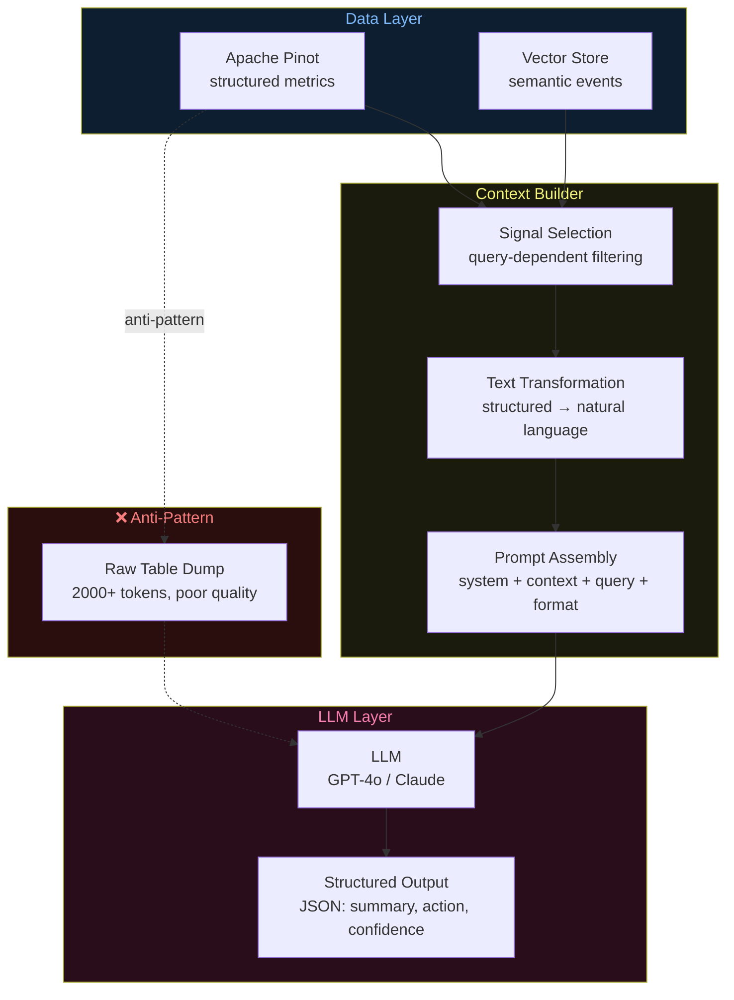
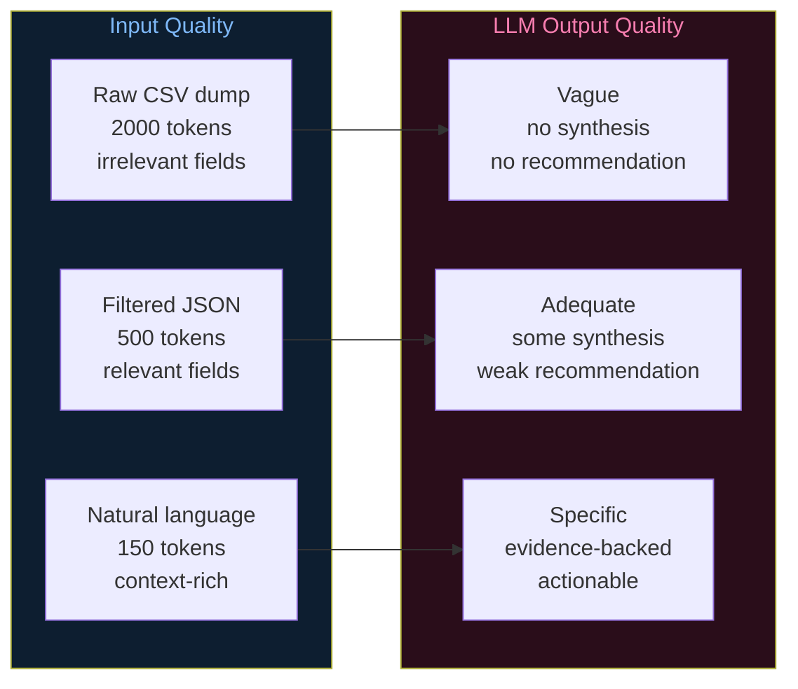

# Architecture Diagrams — Day 10: What LLMs Actually Need

---

## ASCII Diagram — Data → Context Builder → LLM

```
╔══════════════════════════════════════════════════════════════════════════════╗
║  DATA SOURCES                                                                ║
║                                                                              ║
║  [Apache Pinot]                    [Vector Store]                            ║
║  Structured metrics:               Semantic events:                          ║
║  user_id, plan, segment,           "User hit 500 error on /checkout"         ║
║  error_count, error_rate,          "User clicked Upgrade to Pro"             ║
║  churn_risk, intent_score          "User submitted support ticket"           ║
╚══════════════════════════╤═════════════════════════╤════════════════════════╝
                           │                         │
                           └────────────┬────────────┘
                                        │
                                        ▼
╔══════════════════════════════════════════════════════════════════════════════╗
║  CONTEXT BUILDER                                                             ║
║──────────────────────────────────────────────────────────────────────────────║
║                                                                              ║
║  Step 1: SIGNAL SELECTION                                                    ║
║  ┌─────────────────────────────────────────────────────────────────────┐    ║
║  │  Query: "Why is user u_4821 at risk of churning?"                   │    ║
║  │                                                                     │    ║
║  │  INCLUDE:  error_count, error_rate, churn_risk, pricing_visits,     │    ║
║  │            intent_score, plan, segment, recent_events               │    ║
║  │                                                                     │    ║
║  │  EXCLUDE:  signup_date, country, session_id, event_id,              │    ║
║  │            device_type (not relevant to churn question)             │    ║
║  └─────────────────────────────────────────────────────────────────────┘    ║
║                                                                              ║
║  Step 2: TEXT TRANSFORMATION                                                 ║
║  ┌─────────────────────────────────────────────────────────────────────┐    ║
║  │  {error_count: 5, error_rate: 0.5, churn_risk: true}               │    ║
║  │                          ↓                                          │    ║
║  │  "User u_4821 (free plan, at_risk) has 5 checkout errors            │    ║
║  │   (50% error rate). Churn risk: TRUE."                              │    ║
║  └─────────────────────────────────────────────────────────────────────┘    ║
║                                                                              ║
║  Step 3: PROMPT ASSEMBLY                                                     ║
║  ┌─────────────────────────────────────────────────────────────────────┐    ║
║  │  [System prompt] + [Context text] + [Query] + [Output format]      │    ║
║  │  Total tokens: ~350 (vs 2,000+ for raw table dump)                 │    ║
║  └─────────────────────────────────────────────────────────────────────┘    ║
╚══════════════════════════════════════════════════════════════════════════════╝
                                        │
                                        ▼
╔══════════════════════════════════════════════════════════════════════════════╗
║  LLM (GPT-4o / Claude / local model)                                        ║
║                                                                              ║
║  Input:  ~350 tokens of structured context                                  ║
║  Output: JSON { summary, action, confidence, evidence }                     ║
║  Latency: ~500ms                                                             ║
║                                                                              ║
║  The LLM reasons over context — it does NOT query databases.                ║
╚══════════════════════════════════════════════════════════════════════════════╝


RAW TABLE INPUT (what NOT to do):
─────────────────────────────────────────────────────────────────────────────
user_id,event_type,ts,page,error_code,plan,segment,error_rate,churn_risk
u_4821,system.server_error,2026-04-27T14:32:01Z,/checkout,500,free,at_risk,0.5,true
u_4821,system.server_error,2026-04-27T14:35:22Z,/checkout,500,free,at_risk,0.5,true
...

Tokens: ~2,000+
LLM output: vague, no synthesis, no recommendation

CONTEXT-ENGINEERED INPUT (what TO do):
─────────────────────────────────────────────────────────────────────────────
User u_4821 (free plan, at_risk) has 5 checkout errors (50% error rate).
Visited /pricing 3 times. Upgrade intent: 0.82. Churn risk: TRUE.
Recent: 500 error /checkout 14:32 | Clicked "Upgrade to Pro" 14:38

Tokens: ~120
LLM output: specific, actionable, evidence-backed
```

---

## ASCII Diagram — Token Budget

```
CONTEXT WINDOW BUDGET (GPT-4o-mini: 128K tokens)
─────────────────────────────────────────────────────────────────────────────

Typical AI query budget:
┌─────────────────────────────────────────────────────────────────────────┐
│ System prompt          ~150 tokens  ████                                │
│ Retrieved context      ~400 tokens  ████████████                        │
│ User query             ~30 tokens   █                                   │
│ Response space         ~500 tokens  ████████████████                    │
│ ─────────────────────────────────────────────────────────────────────── │
│ Total used:            ~1,080 tokens (0.8% of 128K window)              │
│ Remaining:             ~126,920 tokens (unused)                         │
└─────────────────────────────────────────────────────────────────────────┘

Raw table dump budget (anti-pattern):
┌─────────────────────────────────────────────────────────────────────────┐
│ System prompt          ~150 tokens  ████                                │
│ Raw table (50 rows)    ~3,000 tokens ████████████████████████████████   │
│ User query             ~30 tokens   █                                   │
│ Response space         ~500 tokens  ████████████████                    │
│ ─────────────────────────────────────────────────────────────────────── │
│ Total used:            ~3,680 tokens                                    │
│ Cost ratio:            3.4x more expensive                              │
│ Quality:               WORSE (irrelevant context degrades output)       │
└─────────────────────────────────────────────────────────────────────────┘
```

---

## Mermaid Diagram — Context Engineering Flow



---

## Mermaid Diagram — Context Quality vs Response Quality



---

## Context Builder — Field Selection Matrix

```
FIELD SELECTION BY QUERY TYPE
─────────────────────────────────────────────────────────────────────────────

Field                  Churn Query  Error Query  Upgrade Query  General
─────────────────────────────────────────────────────────────────────────────
plan                   ✅ YES       ✅ YES       ✅ YES         ✅ YES
segment                ✅ YES       ✅ YES       ✅ YES         ✅ YES
error_count            ✅ YES       ✅ YES       ⚠️ MAYBE       ✅ YES
error_rate             ✅ YES       ✅ YES       ❌ NO          ✅ YES
churn_risk             ✅ YES       ✅ YES       ❌ NO          ✅ YES
pricing_visits         ✅ YES       ❌ NO        ✅ YES         ⚠️ MAYBE
intent_score           ✅ YES       ❌ NO        ✅ YES         ⚠️ MAYBE
session_events         ⚠️ MAYBE    ✅ YES       ❌ NO          ⚠️ MAYBE
country                ❌ NO        ❌ NO        ❌ NO          ❌ NO
signup_date            ❌ NO        ❌ NO        ❌ NO          ❌ NO
session_id             ❌ NO        ❌ NO        ❌ NO          ❌ NO
event_id               ❌ NO        ❌ NO        ❌ NO          ❌ NO
device_type            ❌ NO        ⚠️ MAYBE    ❌ NO          ❌ NO
─────────────────────────────────────────────────────────────────────────────
Rule: Only include fields that directly answer or contextualize the query.
      When in doubt, leave it out.
```
