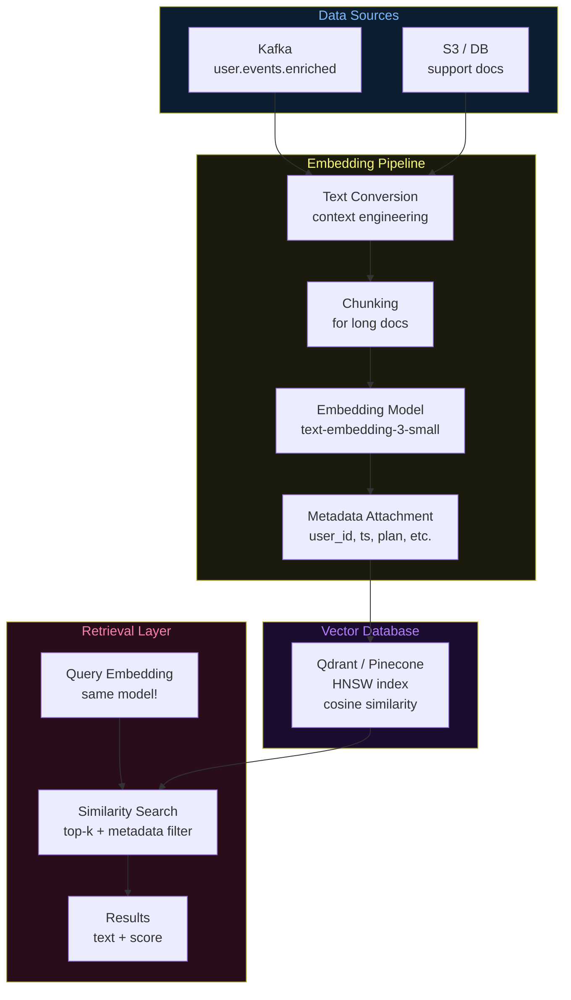
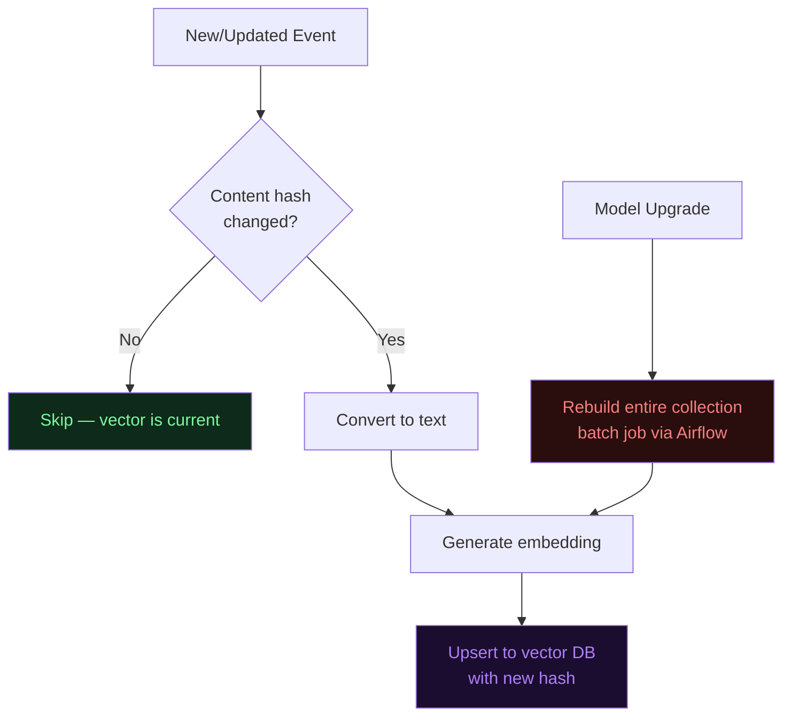

# Architecture Diagrams — Day 11: Embedding Pipelines

---

## ASCII Diagram — Full Embedding Pipeline

```
╔══════════════════════════════════════════════════════════════════════════════╗
║  DATA SOURCES                                                                ║
║  [Kafka: user.events.enriched]  [S3: support docs]  [DB: tickets]           ║
╚══════════════════════════╤═══════════════════════════════════════════════════╝
                           │
                           ▼
╔══════════════════════════════════════════════════════════════════════════════╗
║  STEP 1: TEXT CONVERSION (Context Engineering)                               ║
║                                                                              ║
║  Input:  { event_type: "system.server_error", user_id: "u_4821",            ║
║            page: "/checkout", error_code: 500, plan: "free",                ║
║            error_rate: 0.30, churn_risk: true }                             ║
║                                                                              ║
║  Output: "User u_4821 (free plan, at_risk) hit 500 error on /checkout       ║
║           at 14:32 UTC. Session: 3 errors (30% rate), /pricing 3x.          ║
║           Churn risk: TRUE."                                                 ║
╚══════════════════════════╤═══════════════════════════════════════════════════╝
                           │
                           ▼
╔══════════════════════════════════════════════════════════════════════════════╗
║  STEP 2: CHUNKING (for long documents only)                                  ║
║                                                                              ║
║  Short events (< 512 tokens): no chunking needed                            ║
║  Long documents (support tickets, articles):                                 ║
║    chunk_1: tokens 0–512   (overlap: last 50 tokens)                        ║
║    chunk_2: tokens 462–974 (overlap: last 50 tokens)                        ║
║    chunk_3: tokens 924–...                                                   ║
║                                                                              ║
║  Each chunk gets its own embedding and vector DB entry                      ║
╚══════════════════════════╤═══════════════════════════════════════════════════╝
                           │
                           ▼
╔══════════════════════════════════════════════════════════════════════════════╗
║  STEP 3: EMBEDDING GENERATION                                                ║
║                                                                              ║
║  Model: text-embedding-3-small (OpenAI) or all-MiniLM-L6-v2 (local)        ║
║  Input:  text string                                                         ║
║  Output: dense vector of floats                                              ║
║                                                                              ║
║  text-embedding-3-small: 1536 dimensions, ~50ms/call, $0.02/1M tokens      ║
║  all-MiniLM-L6-v2:       384 dimensions,  ~5ms/call,  free (local)         ║
║                                                                              ║
║  BATCHING: embed 100 texts per API call to reduce latency and cost          ║
╚══════════════════════════╤═══════════════════════════════════════════════════╝
                           │
                           ▼
╔══════════════════════════════════════════════════════════════════════════════╗
║  STEP 4: METADATA ATTACHMENT                                                 ║
║                                                                              ║
║  {                                                                           ║
║    "id":     "evt_c3d4",          ← document ID (for deduplication)         ║
║    "vector": [0.21, -0.84, ...],  ← the embedding                           ║
║    "payload": {                                                              ║
║      "user_id":    "u_4821",      ← filterable                              ║
║      "event_type": "system.server_error",  ← filterable                    ║
║      "ts":         "2026-04-27T14:32:01Z", ← filterable (range)            ║
║      "plan":       "free",        ← filterable                              ║
║      "churn_risk": true,          ← filterable                              ║
║      "text":       "User u_4821..." ← stored for retrieval                  ║
║    }                                                                         ║
║  }                                                                           ║
╚══════════════════════════╤═══════════════════════════════════════════════════╝
                           │
                           ▼
╔══════════════════════════════════════════════════════════════════════════════╗
║  STEP 5: UPSERT TO VECTOR DB                                                 ║
║                                                                              ║
║  Qdrant / Pinecone / pgvector                                                ║
║  Collection: user_events                                                     ║
║  Index type: HNSW (Hierarchical Navigable Small World)                      ║
║  Distance:   Cosine similarity                                               ║
║                                                                              ║
║  Upsert = insert if new, update if ID already exists                        ║
╚══════════════════════════╤═══════════════════════════════════════════════════╝
                           │
                           ▼
╔══════════════════════════════════════════════════════════════════════════════╗
║  STEP 6: RETRIEVAL                                                           ║
║                                                                              ║
║  Query: "checkout errors and payment failures"                               ║
║    → embed query (same model!)                                               ║
║    → search vector DB: top-4 nearest neighbors                              ║
║    → filter: user_id = "u_4821"                                             ║
║    → return: text + similarity score                                         ║
║                                                                              ║
║  Result:                                                                     ║
║    score=0.91 "User u_4821 hit 500 error on /checkout at 14:32"             ║
║    score=0.87 "Payment failed during upgrade attempt"                        ║
║    score=0.84 "Support ticket: checkout keeps failing"                       ║
╚══════════════════════════════════════════════════════════════════════════════╝


PIPELINE TRIGGERS
─────────────────────────────────────────────────────────────────────────────
New event arrives in Kafka     → embed immediately (async consumer)
Enrichment data changes        → re-embed if content_hash changes
Embedding model upgraded       → re-embed entire collection (batch job)
Document deleted               → delete vector by ID
```

---

## ASCII Diagram — Vector Space (Conceptual)

```
2D PROJECTION OF VECTOR SPACE (real embeddings are 1536 dims)
─────────────────────────────────────────────────────────────────────────────

                    "payment failed"
                         ●
                    "checkout error" ●    ● "500 on /checkout"
                                   ● "billing issue"
                              ● "transaction declined"

                                              ← SEMANTIC CLUSTER: checkout/payment problems


    "user upgraded plan" ●

    "purchased pro tier" ●
                              ● "subscription activated"

                              ← SEMANTIC CLUSTER: upgrades/purchases


                                        ● "user logged in"
                                   ● "session started"
                              ● "page view /home"

                              ← SEMANTIC CLUSTER: navigation/session events

─────────────────────────────────────────────────────────────────────────────
Query: "checkout problems"
  → embed query → find nearest neighbors
  → returns: "checkout error", "payment failed", "500 on /checkout"
  → does NOT return: "user upgraded plan", "user logged in"
```

---

## Mermaid Diagram — Embedding Pipeline Architecture



---

## Mermaid Diagram — Re-embedding Trigger Logic


