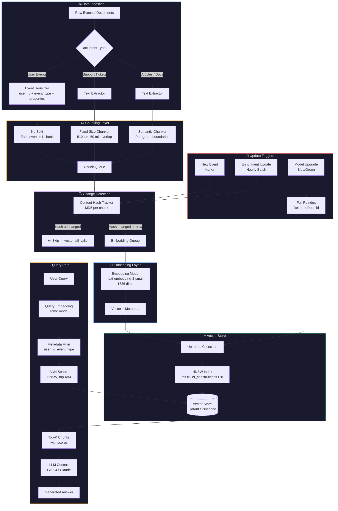
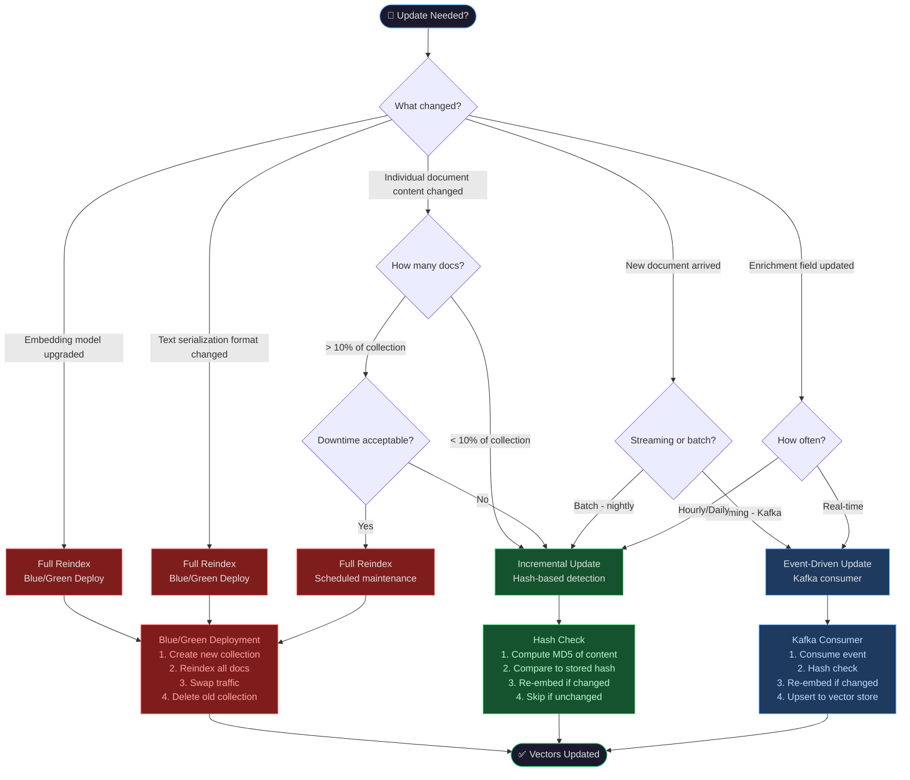

# Day 12 — Vector Storage Architecture Diagrams

---

## Diagram 1: Full Vector Storage Pipeline (ASCII)

```
┌─────────────────────────────────────────────────────────────────────────────────┐
│                         VECTOR STORAGE PIPELINE                                 │
└─────────────────────────────────────────────────────────────────────────────────┘

  RAW TEXT / EVENTS
  ┌──────────────────────────────────────────────────────────────────────────────┐
  │  "User clicked checkout. Payment failed with error 402. User retried twice.  │
  │   Session expired after 30 minutes. User contacted support via chat."        │
  └──────────────────────────────────────────────────────────────────────────────┘
                                      │
                                      ▼
  ┌─────────────────────────────────────────────────────────────────────────────┐
  │                              CHUNKER                                        │
  │                                                                             │
  │  Fixed-size (512 tok, 50 tok overlap):                                      │
  │                                                                             │
  │  ┌──────────────────────────────────────────────────────────────────────┐   │
  │  │ Chunk 1 [tok 0–511]                                                  │   │
  │  │ "User clicked checkout. Payment failed with error 402. User retried  │   │
  │  │  twice. Session expired after 30 minutes. User contacted..."         │   │
  │  └──────────────────────────────────────────────────────────────────────┘   │
  │                                          ▲                                  │
  │                              50-tok overlap (boundary preserved)            │
  │                                          ▼                                  │
  │  ┌──────────────────────────────────────────────────────────────────────┐   │
  │  │ Chunk 2 [tok 462–973]                                                │   │
  │  │ "...User contacted support via chat. Agent responded within 2 min.   │   │
  │  │  Issue resolved: payment gateway timeout. Refund issued..."          │   │
  │  └──────────────────────────────────────────────────────────────────────┘   │
  │                                          ▲                                  │
  │                              50-tok overlap (boundary preserved)            │
  │                                          ▼                                  │
  │  ┌──────────────────────────────────────────────────────────────────────┐   │
  │  │ Chunk 3 [tok 924–1435]                                               │   │
  │  │ "...Refund issued within 24 hours. User satisfaction score: 4/5.     │   │
  │  │  Follow-up email sent. Ticket closed."                               │   │
  │  └──────────────────────────────────────────────────────────────────────┘   │
  └─────────────────────────────────────────────────────────────────────────────┘
                                      │
                                      │  3 chunks
                                      ▼
  ┌─────────────────────────────────────────────────────────────────────────────┐
  │                         EMBEDDING MODEL                                     │
  │                    (text-embedding-3-small, 1536 dims)                      │
  │                                                                             │
  │   Chunk 1 ──► [0.021, -0.134, 0.892, ..., 0.043]  (1536 floats)           │
  │   Chunk 2 ──► [0.156, -0.023, 0.441, ..., -0.112] (1536 floats)           │
  │   Chunk 3 ──► [-0.089, 0.234, 0.123, ..., 0.567]  (1536 floats)           │
  └─────────────────────────────────────────────────────────────────────────────┘
                                      │
                                      │  vectors + metadata
                                      ▼
  ┌─────────────────────────────────────────────────────────────────────────────┐
  │                    VECTOR STORE (Qdrant / Pinecone)                         │
  │                                                                             │
  │  ┌─────────────────────────────────────────────────────────────────────┐   │
  │  │                        HNSW INDEX                                   │   │
  │  │                                                                     │   │
  │  │  Layer 2:  [C1] ─────────────────────────── [C847]                 │   │
  │  │                                                                     │   │
  │  │  Layer 1:  [C1] ──── [C23] ──── [C156] ──── [C847]                 │   │
  │  │                                                                     │   │
  │  │  Layer 0:  [C1]─[C2]─[C3]─...─[C23]─...─[C156]─...─[C847]─[C848] │   │
  │  │                                                                     │   │
  │  │  Each node = one chunk vector                                       │   │
  │  │  Edges = nearest neighbor connections (m=16 per node)               │   │
  │  └─────────────────────────────────────────────────────────────────────┘   │
  │                                                                             │
  │  Metadata payload per vector:                                               │
  │  { doc_id, user_id, chunk_index, timestamp, event_type, churn_risk }       │
  └─────────────────────────────────────────────────────────────────────────────┘
                                      │
                                      │  query: "checkout error"
                                      ▼
  ┌─────────────────────────────────────────────────────────────────────────────┐
  │                           RETRIEVAL                                         │
  │                                                                             │
  │  1. Embed query: "checkout error" → [0.019, -0.128, 0.887, ..., 0.041]    │
  │  2. Filter: user_id = "usr_123"                                             │
  │  3. HNSW search: navigate graph → top-4 nearest neighbors                  │
  │  4. Return: Chunk 1 (score: 0.94), Chunk 2 (score: 0.87), ...             │
  └─────────────────────────────────────────────────────────────────────────────┘
                                      │
                                      │  top-K chunks (context)
                                      ▼
  ┌─────────────────────────────────────────────────────────────────────────────┐
  │                              LLM                                            │
  │                         (GPT-4 / Claude)                                    │
  │                                                                             │
  │  System: "You are a support assistant. Use the context below."              │
  │  Context: [Chunk 1 text] [Chunk 2 text]                                     │
  │  User: "Why did the checkout fail for this user?"                           │
  │                                                                             │
  │  Response: "The checkout failed due to a payment gateway timeout            │
  │             (error 402). The user retried twice before contacting           │
  │             support. A refund was issued within 24 hours."                  │
  └─────────────────────────────────────────────────────────────────────────────┘
```

---

## Diagram 2: Chunk Size Comparison — Precision vs Recall (ASCII)

```
┌─────────────────────────────────────────────────────────────────────────────────┐
│                    CHUNK SIZE COMPARISON                                        │
│                                                                                 │
│  Document: Support ticket with 5 topics (checkout, payment, refund,            │
│            account, shipping)                                                   │
│                                                                                 │
│  Query: "checkout error"                                                        │
└─────────────────────────────────────────────────────────────────────────────────┘

SMALL CHUNKS (128 tokens each)
──────────────────────────────
  [checkout error 402]  [user retried]  [session expired]  [contacted support]
  [agent responded]     [issue resolved] [refund issued]   [ticket closed]
  [account details]     [shipping info]  [plan tier]       [satisfaction score]

  Query "checkout error" retrieves:
  ✅ [checkout error 402]  ← EXACT MATCH (score: 0.97)
  ✅ [user retried]        ← relevant (score: 0.82)
  ❌ [account details]     ← irrelevant (score: 0.61)
  ❌ [shipping info]       ← irrelevant (score: 0.58)

  Precision: HIGH  ████████████████████ 95%
  Recall:    LOW   ████████░░░░░░░░░░░░ 40%
  (answer is in top result, but surrounding context is missing)

MEDIUM CHUNKS (512 tokens each)
────────────────────────────────
  [checkout error 402 + user retried + session expired + contacted support]
  [agent responded + issue resolved + refund issued + ticket closed]
  [account details + shipping info + plan tier + satisfaction score]

  Query "checkout error" retrieves:
  ✅ Chunk 1 ← contains checkout error + full context (score: 0.94)
  ✅ Chunk 2 ← contains resolution context (score: 0.79)
  ❌ Chunk 3 ← irrelevant (score: 0.52)

  Precision: BALANCED  ████████████████░░░░ 80%
  Recall:    BALANCED  ████████████████░░░░ 80%
  (answer + surrounding context retrieved, minimal noise)

LARGE CHUNKS (1024 tokens each)
────────────────────────────────
  [checkout error + payment + refund + account + shipping — ALL TOPICS MIXED]
  [continuation of all topics...]

  Query "checkout error" retrieves:
  ✅ Chunk 1 ← contains answer but also lots of noise (score: 0.71)
  ✅ Chunk 2 ← more noise (score: 0.68)

  Precision: LOW   ████████░░░░░░░░░░░░ 40%
  Recall:    HIGH  ████████████████████ 95%
  (answer is in retrieved chunks, but LLM must filter through noise)

SEMANTIC CHUNKS (paragraph boundaries)
───────────────────────────────────────
  [checkout error 402. User retried twice.]
  [Session expired. User contacted support via chat.]
  [Agent responded. Issue resolved: payment gateway timeout.]
  [Refund issued within 24 hours. Ticket closed.]

  Query "checkout error" retrieves:
  ✅ Chunk 1 ← exact semantic unit (score: 0.96)
  ✅ Chunk 3 ← resolution (score: 0.88)
  ✅ Chunk 2 ← context (score: 0.81)
  ❌ Chunk 4 ← less relevant (score: 0.62)

  Precision: HIGHEST  ████████████████████ 98%
  Recall:    HIGH     ████████████████████ 90%
  (best of both worlds for structured documents)

┌─────────────────────────────────────────────────────────────────────────────────┐
│  SUMMARY                                                                        │
│                                                                                 │
│  Small   │ ████████████████████ Precision │ ████████░░░░░░░░░░░░ Recall       │
│  Medium  │ ████████████████░░░░ Precision │ ████████████████░░░░ Recall       │
│  Large   │ ████████░░░░░░░░░░░░ Precision │ ████████████████████ Recall       │
│  Semantic│ ████████████████████ Precision │ ████████████████████ Recall       │
│                                                                                 │
│  → For RAG: Medium (512 tok) or Semantic chunking                              │
│  → For fact lookup: Small (128 tok)                                            │
│  → For summarization: Large (1024 tok)                                         │
└─────────────────────────────────────────────────────────────────────────────────┘
```

---

## Diagram 3: Full Vector Storage Pipeline (Mermaid Flowchart)



---

## Diagram 4: Update Strategy Decision Tree (Mermaid)



---

## Diagram 5: HNSW Graph Navigation (ASCII)

```
HNSW SEARCH: Find nearest neighbor to query Q

LAYER 2 (sparse, long-range connections)
─────────────────────────────────────────
  Entry → [N1] ──────────────────── [N50] ──── [N200]
                                      │
                              Navigate toward Q

LAYER 1 (medium density)
─────────────────────────
           [N50] ──── [N67] ──── [N89] ──── [N102]
                                   │
                           Navigate toward Q

LAYER 0 (dense, all nodes)
───────────────────────────
  [N89]─[N90]─[N91]─[N92]─[N93]─[N94]─[N95]─[N96]
                              │
                    ┌─────────┴─────────┐
                    │   Local search    │
                    │   beam width=64   │
                    └─────────┬─────────┘
                              │
                         [N93] ← Nearest neighbor found!
                              │
                    cosine_similarity(Q, N93) = 0.94

BRUTE FORCE (for comparison):
──────────────────────────────
  Check N1... check N2... check N3... ... check N999,999... check N1,000,000
  ↑ 1,000,000 cosine similarity computations
  ↑ ~6,000ms

HNSW:
──────
  Layer 2: 3 comparisons
  Layer 1: 8 comparisons
  Layer 0: 64 comparisons (beam search)
  Total: ~75 comparisons
  ↑ ~5ms
  ↑ 1,200x faster, ~95% recall (vs 100% brute force)
```
