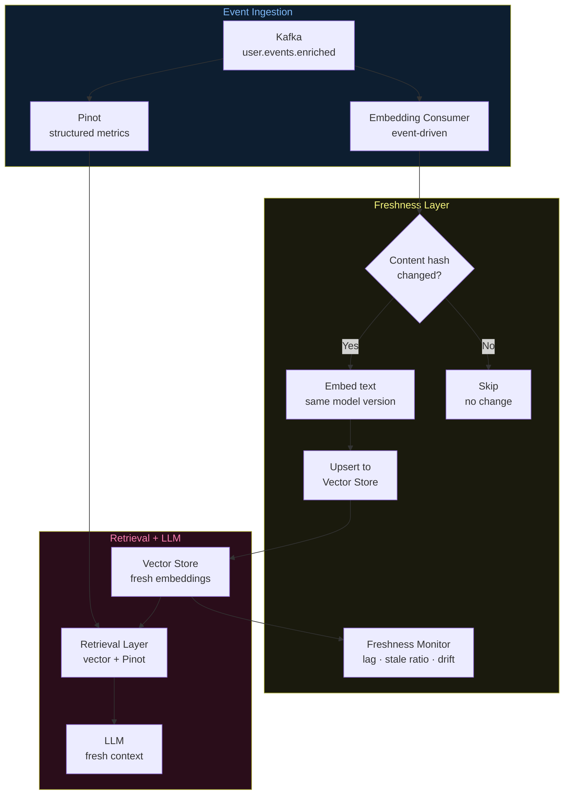

# Architecture Diagrams — Day 13: Data Freshness in RAG Systems

---

## ASCII Diagram — Stale vs Fresh Retrieval

```
STALE RAG SYSTEM (batch embedding, 4-hour delay)
─────────────────────────────────────────────────────────────────────────────

t=0h    Embedding pipeline runs
        Vector store: 10K docs, all current
        ✅ Retrieval is accurate

t=1h    1,000 new events arrive in Kafka
        Flink enriches them → Pinot (queryable)
        ❌ Vector store: NOT updated (batch job hasn't run)

t=2h    User u_4821 hits 5 checkout errors
        Pinot: shows 5 errors, churn_risk=TRUE
        ❌ Vector store: still shows "0 errors, healthy"

t=2h    Support agent asks: "Is u_4821 having issues?"
        Vector store retrieves: "User u_4821 viewed /home. No issues."
        LLM responds: "User appears healthy. No action needed."
        ❌ WRONG — user has 5 errors and is about to churn

t=4h    Batch embedding job runs
        Vector store updated with 4 hours of events
        ✅ Retrieval now accurate — but 4 hours too late


FRESH RAG SYSTEM (event-driven embedding, < 5s delay)
─────────────────────────────────────────────────────────────────────────────

t=0h    Embedding pipeline starts (Kafka consumer)
        Vector store: 10K docs, all current

t=1h    1,000 new events arrive in Kafka
        Flink enriches → Pinot (queryable in ~1s)
        Embedding consumer reads same events
        ✅ Vector store: updated within ~3 seconds

t=2h    User u_4821 hits 5 checkout errors
        Pinot: shows 5 errors, churn_risk=TRUE
        ✅ Vector store: "User u_4821 (free plan) hit 500 error on /checkout.
                          5 errors (50% rate). Churn risk: TRUE."

t=2h    Support agent asks: "Is u_4821 having issues?"
        Vector store retrieves: "5 checkout errors, 50% rate, churn risk TRUE"
        LLM responds: "User u_4821 is at HIGH churn risk. Escalate immediately."
        ✅ CORRECT — based on current state
```

---

## ASCII Diagram — Freshness Pipeline Architecture

```
╔══════════════════════════════════════════════════════════════════════════════╗
║  KAFKA: user.events.enriched                                                 ║
╚══════════════════════════╤═══════════════════════════════════════════════════╝
                           │
              ┌────────────┴────────────┐
              │                         │
              ▼                         ▼
╔═════════════════════════╗   ╔══════════════════════════════════════════════╗
║  PINOT CONNECTOR        ║   ║  EMBEDDING CONSUMER (event-driven)           ║
║  → Pinot real-time      ║   ║                                              ║
║    table                ║   ║  for event in kafka.consume():               ║
║  → queryable in ~1s     ║   ║    text  = event_to_text(event)              ║
╚═════════════════════════╝   ║    hash  = sha256(text)[:16]                 ║
                              ║    if hash != stored_hash(event.id):         ║
                              ║      vector = embed(text)                    ║
                              ║      vector_store.upsert(...)                ║
                              ║      store_hash(event.id, hash)              ║
                              ║    else:                                     ║
                              ║      skip (no change)                        ║
                              ╚══════════════════╤═══════════════════════════╝
                                                 │
                                                 ▼
╔══════════════════════════════════════════════════════════════════════════════╗
║  VECTOR STORE (Qdrant / Pinecone)                                            ║
║                                                                              ║
║  Each document tagged with:                                                  ║
║  { model_name, model_version, embedded_at, content_hash }                   ║
╚══════════════════════════╤═══════════════════════════════════════════════════╝
                           │
                           ▼
╔══════════════════════════════════════════════════════════════════════════════╗
║  FRESHNESS MONITOR                                                           ║
║                                                                              ║
║  Tracks:                                                                     ║
║  ├── embedding_lag_p50/p99  (time from event to embedded)                   ║
║  ├── stale_doc_ratio        (% docs older than TTL)                         ║
║  ├── index_age_max          (oldest document in index)                      ║
║  └── hash_mismatch_rate     (% docs where source has changed)               ║
║                                                                              ║
║  Alerts when:                                                                ║
║  ├── embedding_lag_p99 > 300s                                               ║
║  └── stale_doc_ratio > 5%                                                   ║
╚══════════════════════════╤═══════════════════════════════════════════════════╝
                           │
                           ▼
╔══════════════════════════════════════════════════════════════════════════════╗
║  RETRIEVAL LAYER → LLM                                                       ║
║  Fresh context → accurate LLM responses                                     ║
╚══════════════════════════════════════════════════════════════════════════════╝
```

---

## Mermaid Diagram — Freshness-Aware RAG Pipeline



---

## Freshness Strategy Decision Matrix

```
USE CASE                    FRESHNESS SLA    STRATEGY              TTL
─────────────────────────────────────────────────────────────────────────────
Fraud detection             < 1 second       Event-driven          None
Support tooling             < 5 seconds      Event-driven          None
Churn detection             < 30 seconds     Event-driven          None
LLM context assembly        < 60 seconds     Event-driven + TTL    60s
Real-time personalization   < 5 seconds      Event-driven          None
Hourly analytics            < 1 hour         Micro-batch (5min)    1h
Daily reports               < 24 hours       Daily batch           24h
Product catalog             < 7 days         Weekly batch          7d
Historical documents        Static           One-time + on-change  Never
─────────────────────────────────────────────────────────────────────────────

Rule: Match embedding update frequency to the freshness SLA of the use case.
      Never use batch embedding for real-time AI features.
```
