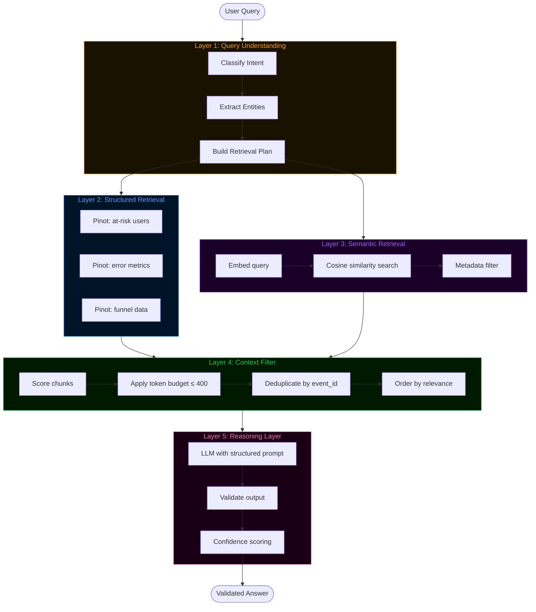
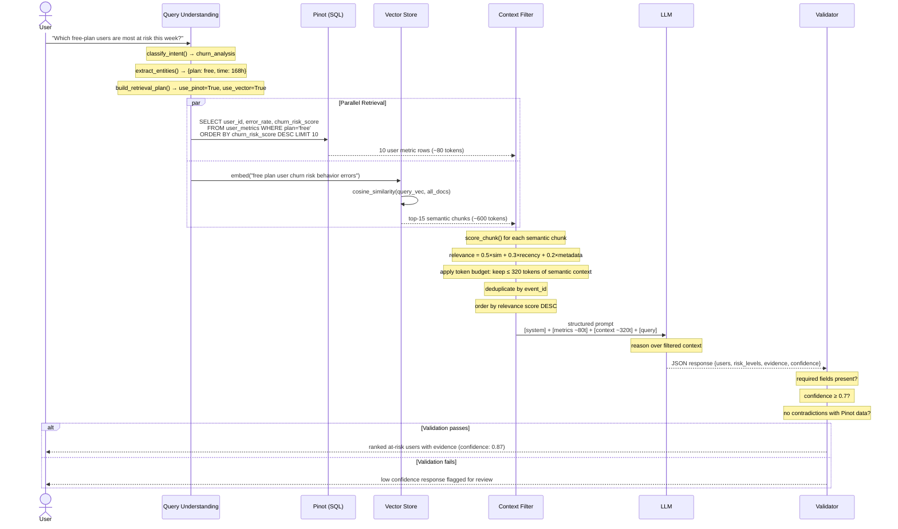

# Day 15 — Architecture Diagrams: RAG in Production

---

## 1. ASCII Comparison: Toy RAG vs Production RAG

```
╔══════════════════════════════════════════════════════════════════════════════╗
║                         TOY RAG  (fails in production)                      ║
╚══════════════════════════════════════════════════════════════════════════════╝

  User Query
      │
      ▼
  ┌─────────────────────────────────────────────────────────────────────────┐
  │  Step 1: Embed Query                                                    │
  │  embed("show me errors")  →  [0.12, -0.34, 0.87, ...]                  │
  │  ⚠ No intent classification. "show me errors" and "why is user         │
  │    churning?" get identical treatment.                                  │
  └──────────────────────────────────┬──────────────────────────────────────┘
                                     │
                                     ▼
  ┌─────────────────────────────────────────────────────────────────────────┐
  │  Step 2: Vector Search (top-k=5)                                        │
  │  cosine_similarity(query_vec, all_docs) → top 5 chunks                 │
  │  ⚠ No structured retrieval. Can't answer "how many errors in 1h?"      │
  │  ⚠ No freshness check. Stale embeddings return wrong context.          │
  │  ⚠ No relevance filtering. All 5 chunks go to LLM regardless.          │
  └──────────────────────────────────┬──────────────────────────────────────┘
                                     │
                                     ▼
  ┌─────────────────────────────────────────────────────────────────────────┐
  │  Step 3: LLM                                                            │
  │  prompt = system_prompt + top_5_chunks + user_query                    │
  │  response = llm.complete(prompt)                                        │
  │  ⚠ No output validation. Hallucinated user IDs pass through.           │
  │  ⚠ No confidence scoring. Wrong answers look like right answers.       │
  └─────────────────────────────────────────────────────────────────────────┘
                                     │
                                     ▼
                               Answer (maybe wrong)


╔══════════════════════════════════════════════════════════════════════════════╗
║                    PRODUCTION RAG  (5 layers, each solving a failure mode)  ║
╚══════════════════════════════════════════════════════════════════════════════╝

  User Query
      │
      ▼
  ┌─────────────────────────────────────────────────────────────────────────┐
  │  LAYER 1: Query Understanding                                           │
  │                                                                         │
  │  classify_intent(query)   → churn_analysis | error_investigation |     │
  │                              upgrade_analysis | retention_analysis |   │
  │                              general                                    │
  │                                                                         │
  │  extract_entities(query)  → {user_id, time_range_hours,                │
  │                               plan_filter, segment_filter}              │
  │                                                                         │
  │  build_retrieval_plan()   → {use_pinot, use_vector, pinot_filters,     │
  │                               vector_query, top_k, freshness_required} │
  │                                                                         │
  │  ✓ Different query types get different retrieval strategies.            │
  └──────────────────────────────────┬──────────────────────────────────────┘
                                     │
                    ┌────────────────┴────────────────┐
                    │  (parallel retrieval)            │
                    ▼                                  ▼
  ┌──────────────────────────┐      ┌──────────────────────────────────────┐
  │  LAYER 2: Structured     │      │  LAYER 3: Semantic Retrieval         │
  │  Retrieval (Pinot SQL)   │      │  (Vector Store)                      │
  │                          │      │                                      │
  │  • counts & aggregations │      │  • behavioral context                │
  │  • time-range filters    │      │  • semantic similarity               │
  │  • rankings by metric    │      │  • event narratives                  │
  │  • plan/segment filters  │      │  • "why" questions                   │
  │                          │      │  • metadata-filtered search          │
  │  ✓ Facts, numbers, SQL   │      │  ✓ Context, patterns, meaning        │
  └──────────────┬───────────┘      └──────────────────┬───────────────────┘
                 │                                      │
                 └──────────────────┬───────────────────┘
                                    │
                                    ▼
  ┌─────────────────────────────────────────────────────────────────────────┐
  │  LAYER 4: Context Filter                                                │
  │                                                                         │
  │  score_chunk()     → relevance = 0.5×similarity + 0.3×recency          │
  │                                + 0.2×metadata_match                    │
  │                                                                         │
  │  filter_context()  → drop below threshold, token budget ≤ 400,        │
  │                       deduplicate by event_id, order by relevance      │
  │                                                                         │
  │  format_context()  → natural language for LLM                          │
  │                                                                         │
  │  ✓ LLM receives only the most relevant, non-redundant context.         │
  └──────────────────────────────────┬──────────────────────────────────────┘
                                     │
                                     ▼
  ┌─────────────────────────────────────────────────────────────────────────┐
  │  LAYER 5: Reasoning Layer (LLM + Validation)                            │
  │                                                                         │
  │  mock_llm(prompt, intent)   → structured JSON response                 │
  │                                                                         │
  │  validate_output(response)  → required fields present?                 │
  │                               confidence ≥ threshold?                  │
  │                               no contradictions with structured data?  │
  │                                                                         │
  │  ✓ Hallucinated outputs are caught before reaching downstream.         │
  └─────────────────────────────────────────────────────────────────────────┘
                                     │
                                     ▼
                          Validated Answer + Confidence


What each layer adds:
─────────────────────────────────────────────────────────────────────────────
Layer 1 (Query Understanding)  → routes queries to the right retrieval strategy
Layer 2 (Structured Retrieval) → answers factual, countable, time-range questions
Layer 3 (Semantic Retrieval)   → surfaces behavioral context and "why" patterns
Layer 4 (Context Filter)       → removes noise, enforces token budget, deduplicates
Layer 5 (Reasoning + Validate) → catches hallucinations, enforces output schema
```

---

## 2. Mermaid Flowchart — Production RAG Architecture



---

## 3. Mermaid Sequence Diagram — Full Production RAG Request



---

## 4. Token Budget Visualization

```
Total LLM Context Budget: 400 tokens
━━━━━━━━━━━━━━━━━━━━━━━━━━━━━━━━━━━━━━━━━━━━━━━━━━━━━━━━━━━━━━━━━━━━━━━━━━━━

System prompt:        [████████████████████] ~80 tokens  (always included)
Structured metrics:   [████████████████████] ~80 tokens  (Pinot results)
Semantic chunk 1:     [████████████████████] ~80 tokens  (score: 0.91)
Semantic chunk 2:     [████████████████████] ~80 tokens  (score: 0.84)
Semantic chunk 3:     [████████████████████] ~80 tokens  (score: 0.71)
                      ─────────────────────────────────────────────────
                      Total: 400 tokens ✓

Dropped (over budget):
  Semantic chunk 4:   [░░░░░░░░░░░░░░░░░░░░] ~80 tokens  (score: 0.62) ✗
  Semantic chunk 5:   [░░░░░░░░░░░░░░░░░░░░] ~80 tokens  (score: 0.54) ✗
  ...11 more chunks dropped...

Result: LLM receives focused, relevant context. Quality improves.
```

---

## 5. Retrieval Routing Decision Tree

```
                         User Query
                              │
                              ▼
                    ┌─────────────────┐
                    │ classify_intent │
                    └────────┬────────┘
                             │
          ┌──────────────────┼──────────────────┐
          │                  │                  │
          ▼                  ▼                  ▼
   churn_analysis    error_investigation   upgrade_analysis
   retention_analysis                      general
          │                  │                  │
          ▼                  ▼                  ▼
   Pinot: top users    Pinot: error counts  Pinot: upgrade
   by churn_risk       by user/time         funnel metrics
   Vector: behavioral  Vector: error        Vector: feature
   context per user    event context        engagement context
   top_k=5             top_k=3              top_k=3
   freshness=True      freshness=True       freshness=False
```
