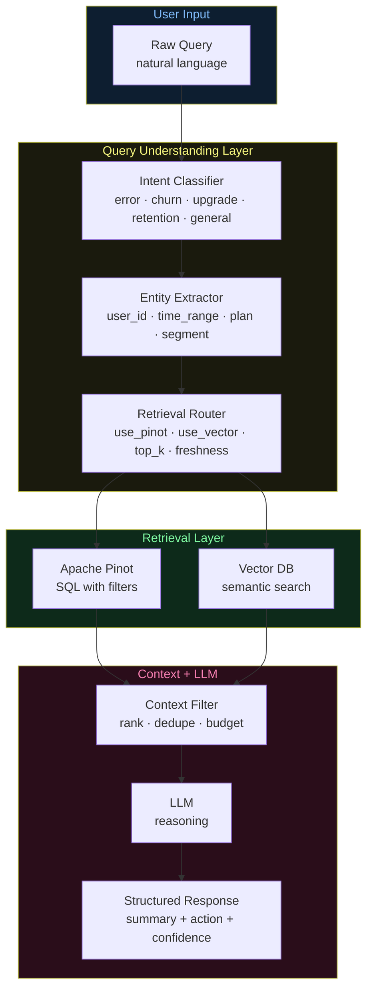

# Architecture Diagrams — Day 16: Query Understanding Layer

---

## ASCII Diagram — Without vs With Query Understanding

```
WITHOUT QUERY UNDERSTANDING (naive RAG)
─────────────────────────────────────────────────────────────────────────────

User: "Which free-plan users are most at risk this week?"
    │
    ▼
[Embed raw query string]
    │
    ▼
[Vector search: top-5 results]
    │  Returns: random events, possibly from wrong users, wrong time range
    ▼
[LLM]
    │  Receives: 5 generic event descriptions, no metrics, no structure
    ▼
"Based on the retrieved documents, some users appear to have experienced
 errors. It's difficult to determine specific risk levels without more data."
    ❌ Vague. No users named. No evidence. Not actionable.


WITH QUERY UNDERSTANDING (production RAG)
─────────────────────────────────────────────────────────────────────────────

User: "Which free-plan users are most at risk this week?"
    │
    ▼
╔══════════════════════════════════════════════════════════════════════════╗
║  QUERY UNDERSTANDING LAYER                                               ║
║                                                                          ║
║  Intent:     churn_analysis                                              ║
║  User:       None (all users)                                            ║
║  Time:       7 days                                                      ║
║  Plan:       free                                                        ║
║  Filters:    churn_risk=true                                             ║
║                                                                          ║
║  Retrieval plan:                                                         ║
║    Pinot:    SELECT user_id, error_rate, intent_score                    ║
║              WHERE plan='free' AND churn_risk=true                       ║
║              AND ts > ago('7d') ORDER BY error_rate DESC LIMIT 10       ║
║    Vector:   "churn risk behavior errors disengagement free"             ║
║    top_k:    5                                                           ║
║    freshness: medium (< 60s)                                            ║
║    token_budget: 400                                                     ║
╚══════════════════════════════════════════════════════════════════════════╝
    │
    ├──────────────────────────────────────────────┐
    ▼                                              ▼
[Pinot SQL]                                 [Vector Search]
Top 10 at-risk free users                   Top-5 behavioral events
with error_rate, intent_score               filtered to at-risk users
    │                                              │
    └──────────────────────────────────────────────┘
                           │
                           ▼
                   [Context Filter]
                   Select top-5 users with richest context
                   Token budget: 400
                           │
                           ▼
                        [LLM]
                           │
                           ▼
"Top at-risk users this week:
 1. u_4821 (free, 50% error rate): 3 checkout failures, upgrade intent 0.82
    → Recommend: fix checkout + send upgrade offer
 2. u_7734 (free, 33% error rate): 2 errors, visited /pricing twice
    → Recommend: proactive outreach"
    ✅ Specific users. Evidence. Actionable recommendations.
```

---

## ASCII Diagram — Query Understanding Components

```
RAW QUERY
"Show me errors for user u_4821 in the last 2 hours"
    │
    ▼
╔══════════════════════════════════════════════════════════════════════════╗
║  INTENT CLASSIFIER                                                       ║
║                                                                          ║
║  Keyword signals:                                                        ║
║    "errors"     → error_investigation                                    ║
║    "u_4821"     → single user scope                                      ║
║    "last 2 hours" → short time window, high freshness                   ║
║                                                                          ║
║  Output: intent = error_investigation                                    ║
╚══════════════════════════════════════════════════════════════════════════╝
    │
    ▼
╔══════════════════════════════════════════════════════════════════════════╗
║  ENTITY EXTRACTOR                                                        ║
║                                                                          ║
║  user_id:    "u_4821"    (pattern: u_\d+)                               ║
║  time_range: 2 hours     ("last 2 hours" → 2h)                         ║
║  plan:       None        (not mentioned)                                 ║
║  segment:    None        (not mentioned)                                 ║
║  event_type: "error"     (keyword: "errors")                            ║
╚══════════════════════════════════════════════════════════════════════════╝
    │
    ▼
╔══════════════════════════════════════════════════════════════════════════╗
║  RETRIEVAL ROUTER                                                        ║
║                                                                          ║
║  use_pinot:    True   (need exact error counts)                         ║
║  use_vector:   True   (need behavioral context)                         ║
║  pinot_filters: {user_id: "u_4821", has_errors: True, time: "2h"}      ║
║  vector_query: "error failure crash exception u_4821"                   ║
║  top_k:        3      (focused single-user query)                       ║
║  freshness:    high   (< 5 seconds)                                     ║
║  token_budget: 200                                                       ║
╚══════════════════════════════════════════════════════════════════════════╝
    │
    ▼
[Retrieval Layer]  →  [Context Filter]  →  [LLM]
```

---

## Mermaid Diagram — Full Query Understanding Architecture



---

## Intent → Retrieval Strategy Matrix

```
INTENT              PINOT    VECTOR   FRESHNESS   TOP_K   TOKEN_BUDGET
─────────────────────────────────────────────────────────────────────────────
error_investigation  ✅       ✅       HIGH (<5s)   3       200
churn_analysis       ✅       ✅       MEDIUM(<60s) 5       400
upgrade_analysis     ✅       ✅       LOW (<1h)    3       300
retention_analysis   ✅       ✅       LOW (<24h)   5       400
operational          ✅       ❌       CRITICAL(<1s)2       100
general              ❌       ✅       LOW (<1h)    3       200
─────────────────────────────────────────────────────────────────────────────

Rule: Match retrieval strategy to intent. Not every query needs both systems.
      Operational queries need Pinot only (speed). General queries need Vector only.
```
