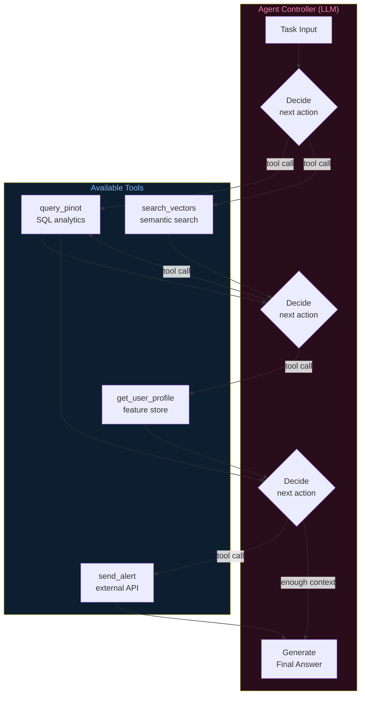
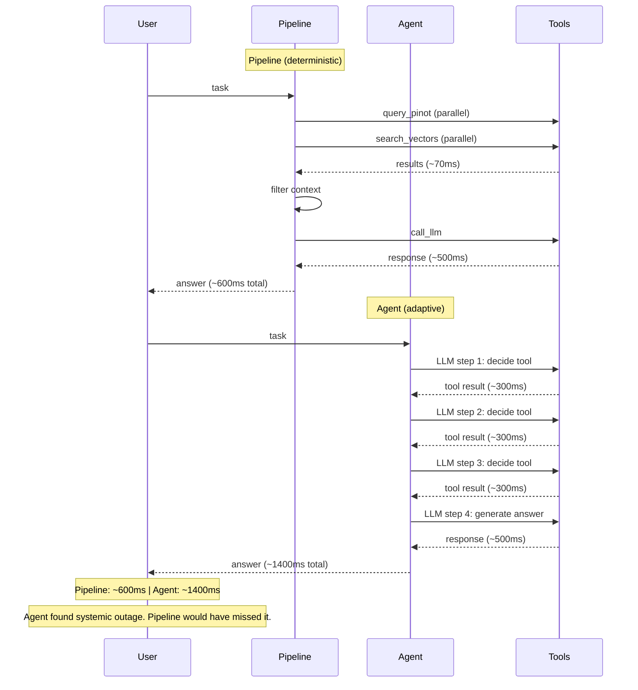

# Architecture Diagrams — Day 17: Agents vs Pipelines

---

## ASCII Diagram — Pipeline vs Agent Architecture

```
PIPELINE ARCHITECTURE (deterministic)
─────────────────────────────────────────────────────────────────────────────

Task: "Why is user u_4821 at risk?"
    │
    ▼
Step 1: Parse query → intent=churn, user_id=u_4821
    │
    ▼
Step 2: Query Pinot (ALWAYS)
    │  SELECT error_rate, churn_risk WHERE user_id='u_4821'
    │  Result: {error_rate: 0.50, churn_risk: true}
    ▼
Step 3: Search vectors (ALWAYS)
    │  embed("churn risk u_4821") → top-4 events
    │  Result: ["hit 500 error", "clicked upgrade", ...]
    ▼
Step 4: Filter context (ALWAYS)
    │  Select top-3 most relevant chunks
    ▼
Step 5: Call LLM (ALWAYS)
    │  Receives: structured metrics + semantic context
    ▼
Step 6: Return response

Execution path: FIXED. Same 6 steps every time.
Latency: ~300ms (predictable)
Cost: 1 LLM call (predictable)
Reliability: HIGH (no dynamic decisions)


AGENT ARCHITECTURE (adaptive)
─────────────────────────────────────────────────────────────────────────────

Task: "Why is user u_4821 at risk?"
    │
    ▼
╔══════════════════════════════════════════════════════════════════════════╗
║  LLM CONTROLLER (step 1)                                                 ║
║  Receives: task description + available tools                            ║
║  Decides: call query_pinot(user_id=u_4821, time=2h)                     ║
╚══════════════════════════════════════════════════════════════════════════╝
    │
    ▼
[query_pinot] → {errors: 5, error_rate: 0.80, page: /checkout}
    │
    ▼
╔══════════════════════════════════════════════════════════════════════════╗
║  LLM CONTROLLER (step 2)                                                 ║
║  Observes: 5 errors on /checkout                                         ║
║  Decides: call search_vectors("checkout errors u_4821")                  ║
╚══════════════════════════════════════════════════════════════════════════╝
    │
    ▼
[search_vectors] → ["payment gateway timeout", "checkout failing"]
    │
    ▼
╔══════════════════════════════════════════════════════════════════════════╗
║  LLM CONTROLLER (step 3)                                                 ║
║  Observes: "payment gateway timeout" — this might be systemic           ║
║  Decides: call query_pinot("gateway errors last 2h") ← NEW STEP        ║
╚══════════════════════════════════════════════════════════════════════════╝
    │
    ▼
[query_pinot] → {gateway_errors: 847, affected_users: 23}
    │
    ▼
╔══════════════════════════════════════════════════════════════════════════╗
║  LLM CONTROLLER (step 4)                                                 ║
║  Observes: systemic outage affecting 23 users                            ║
║  Decides: generate_answer (enough context)                               ║
╚══════════════════════════════════════════════════════════════════════════╝
    │
    ▼
"Root cause: payment gateway outage. 23 users affected.
 Recommend: proactive outreach to all 23 users."

Execution path: ADAPTIVE. Steps 3 was not in the pipeline.
Latency: ~800ms (variable — depends on steps taken)
Cost: 4 LLM calls (variable)
Reliability: MEDIUM (depends on LLM decisions)
```

---

## ASCII Diagram — When to Use Each

```
DECISION FRAMEWORK: Pipeline or Agent?
─────────────────────────────────────────────────────────────────────────────

Is the execution path known in advance?
    │
    ├── YES → Use a PIPELINE
    │         Examples:
    │           - Standard churn query (always: Pinot + Vector + LLM)
    │           - Embedding pipeline (always: text → embed → upsert)
    │           - Batch feature computation (always: read → transform → write)
    │
    └── NO → Does the next step depend on the previous result?
                │
                ├── NO → Use a PIPELINE with conditional branches
                │        (if/else logic, not LLM decisions)
                │
                └── YES → Is the task high-volume or latency-critical?
                              │
                              ├── YES → Use a PIPELINE
                              │        (agents are too slow for hot paths)
                              │
                              └── NO → Use an AGENT
                                       Examples:
                                         - Root cause analysis
                                         - Multi-step investigation
                                         - Dynamic tool selection
                                         - Open-ended research tasks
```

---

## ASCII Diagram — Agent Tool Architecture

```
AGENT TOOL REGISTRY
─────────────────────────────────────────────────────────────────────────────

Available tools (what the agent can call):

┌─────────────────────────────────────────────────────────────────────────┐
│  Tool: query_pinot                                                       │
│  Description: Run SQL against real-time analytics (Apache Pinot)        │
│  Input:  { sql: string, timeout_ms: int }                               │
│  Output: { rows: list[dict], latency_ms: int }                          │
│  Latency: ~68ms | Reliability: HIGH                                     │
├─────────────────────────────────────────────────────────────────────────┤
│  Tool: search_vectors                                                    │
│  Description: Semantic search over event history                        │
│  Input:  { query: string, user_id: string, top_k: int }                │
│  Output: { results: list[{text, score}] }                               │
│  Latency: ~50ms | Reliability: HIGH                                     │
├─────────────────────────────────────────────────────────────────────────┤
│  Tool: get_user_profile                                                  │
│  Description: Fetch user profile from feature store                     │
│  Input:  { user_id: string }                                            │
│  Output: { plan, segment, ltv, signup_date }                            │
│  Latency: ~10ms | Reliability: HIGH                                     │
├─────────────────────────────────────────────────────────────────────────┤
│  Tool: send_alert                                                        │
│  Description: Send alert to support team                                │
│  Input:  { user_id: string, message: string, priority: string }        │
│  Output: { alert_id: string, sent: bool }                               │
│  Latency: ~200ms | Reliability: MEDIUM (external API)                  │
└─────────────────────────────────────────────────────────────────────────┘

Agent receives tool registry at initialization.
LLM selects tools by name based on descriptions.
Tool outputs are appended to agent context for next decision.
```

---

## Mermaid Diagram — Agent Orchestration Flow



---

## Mermaid Diagram — Pipeline vs Agent Latency


