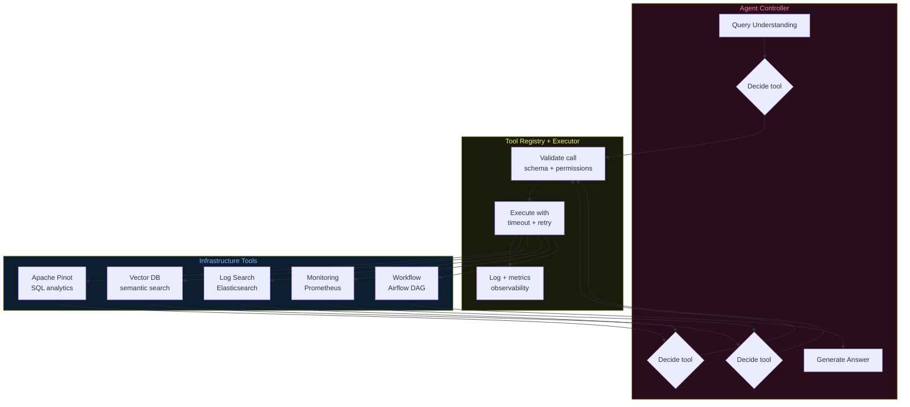

# Architecture Diagrams — Day 18: Tooling for Agents

---

## ASCII Diagram — Agent Tool Architecture

```
USER QUERY: "The checkout error rate spiked. What's happening?"
                              │
                              ▼
╔══════════════════════════════════════════════════════════════════════════════╗
║  QUERY UNDERSTANDING LAYER                                                   ║
║  intent=operational, time=10m, freshness=critical                           ║
╚══════════════════════════╤═══════════════════════════════════════════════════╝
                           │
                           ▼
╔══════════════════════════════════════════════════════════════════════════════╗
║  AGENT CONTROLLER (LLM)                                                      ║
║  Receives: task + tool registry                                              ║
║  Decides: which tool to call next                                            ║
╚══════════════════════════╤═══════════════════════════════════════════════════╝
                           │
                           ▼
╔══════════════════════════════════════════════════════════════════════════════╗
║  TOOL REGISTRY                                                               ║
║  Validates: tool name exists, input schema matches, permissions OK          ║
╚══════════════════════════╤═══════════════════════════════════════════════════╝
                           │
              ┌────────────┼────────────┬────────────┬────────────┐
              ▼            ▼            ▼            ▼            ▼
╔═══════════════╗ ╔══════════════╗ ╔══════════╗ ╔══════════╗ ╔══════════════╗
║ query_pinot   ║ ║search_vectors║ ║query_logs║ ║query_mon ║ ║trigger_dag   ║
║               ║ ║              ║ ║          ║ ║itoring   ║ ║              ║
║ Apache Pinot  ║ ║ Qdrant /     ║ ║Elastic-  ║ ║Prometheus║ ║Apache Airflow║
║ SQL analytics ║ ║ Pinecone     ║ ║search    ║ ║/ Grafana ║ ║              ║
║               ║ ║              ║ ║          ║ ║          ║ ║              ║
║ ~68ms P99     ║ ║ ~50ms P99    ║ ║~100ms    ║ ║~50ms     ║ ║~200ms        ║
║ Timeout: 2s   ║ ║ Timeout: 1s  ║ ║Timeout:3s║ ║Timeout:2s║ ║Timeout: 5s   ║
╚═══════════════╝ ╚══════════════╝ ╚══════════╝ ╚══════════╝ ╚══════════════╝
              │            │            │            │            │
              └────────────┴────────────┴────────────┴────────────┘
                                        │
                                        ▼
╔══════════════════════════════════════════════════════════════════════════════╗
║  TOOL EXECUTOR                                                               ║
║  ├── Timeout enforcement (per-tool SLA)                                     ║
║  ├── Retry with exponential backoff (max 3 attempts)                        ║
║  ├── Fallback response on failure                                           ║
║  └── Observability: log name, args, result, latency, success/failure        ║
╚══════════════════════════╤═══════════════════════════════════════════════════╝
                           │
                           ▼
╔══════════════════════════════════════════════════════════════════════════════╗
║  AGENT CONTROLLER (LLM)                                                      ║
║  Observes tool result → decides next action                                 ║
╚══════════════════════════════════════════════════════════════════════════════╝
```

---

## ASCII Diagram — Tool Reliability Layers

```
TOOL CALL LIFECYCLE
─────────────────────────────────────────────────────────────────────────────

Agent decides: call query_pinot(sql="SELECT...", timeout_ms=2000)
    │
    ▼
[VALIDATION LAYER]
    ├── Tool name in registry?          ✅ query_pinot exists
    ├── Required fields present?        ✅ sql provided
    ├── Types correct?                  ✅ sql=string, timeout_ms=int
    └── Permission check?               ✅ role has query_pinot access
    │
    ▼ (validation passed)
[EXECUTION LAYER]
    ├── Start timer
    ├── Call Pinot broker HTTP endpoint
    │
    ├── SUCCESS (< 2s):
    │     Return {rows: [...], latency_ms: 68}
    │     Log: {tool: "query_pinot", success: true, latency: 68ms}
    │
    ├── TIMEOUT (> 2s):
    │     Attempt 1 failed → wait 100ms → retry
    │     Attempt 2 failed → wait 200ms → retry
    │     Attempt 3 failed → return {error: "timeout", fallback: true}
    │     Log: {tool: "query_pinot", success: false, error: "timeout", attempts: 3}
    │
    └── ERROR (5xx, network):
          Return {error: "service_unavailable", fallback: true}
          Log: {tool: "query_pinot", success: false, error: "5xx"}
    │
    ▼
[OBSERVABILITY LAYER]
    Every call logged to:
    ├── Application logs (structured JSON)
    ├── Metrics: tool_call_latency_ms, tool_call_success_rate
    └── Traces: distributed trace with tool call as span
```

---

## ASCII Diagram — Tool Permission Model

```
ROLE-BASED TOOL ACCESS
─────────────────────────────────────────────────────────────────────────────

Role: support_agent
  ✅ query_pinot          (read-only analytics)
  ✅ search_vectors       (read-only semantic search)
  ✅ get_user_profile     (read-only profile lookup)
  ❌ query_logs           (not needed for support)
  ❌ send_alert           (cannot trigger alerts)
  ❌ trigger_airflow_dag  (cannot trigger workflows)
  ❌ delete_records       (never)

Role: on_call_engineer
  ✅ query_pinot
  ✅ search_vectors
  ✅ get_user_profile
  ✅ query_logs           (needs logs for debugging)
  ✅ query_monitoring     (needs metrics)
  ✅ send_alert           (can trigger alerts)
  ✅ trigger_airflow_dag  (can trigger failover)
  ❌ delete_records       (never via agent)

Role: admin
  ✅ All read tools
  ✅ All write tools (with confirmation required)
  ❌ delete_records       (always requires human confirmation)

Rule: Agents inherit the permissions of the role that invoked them.
      Write tools require explicit confirmation or dry-run mode.
```

---

## Mermaid Diagram — Tool Orchestration Flow


