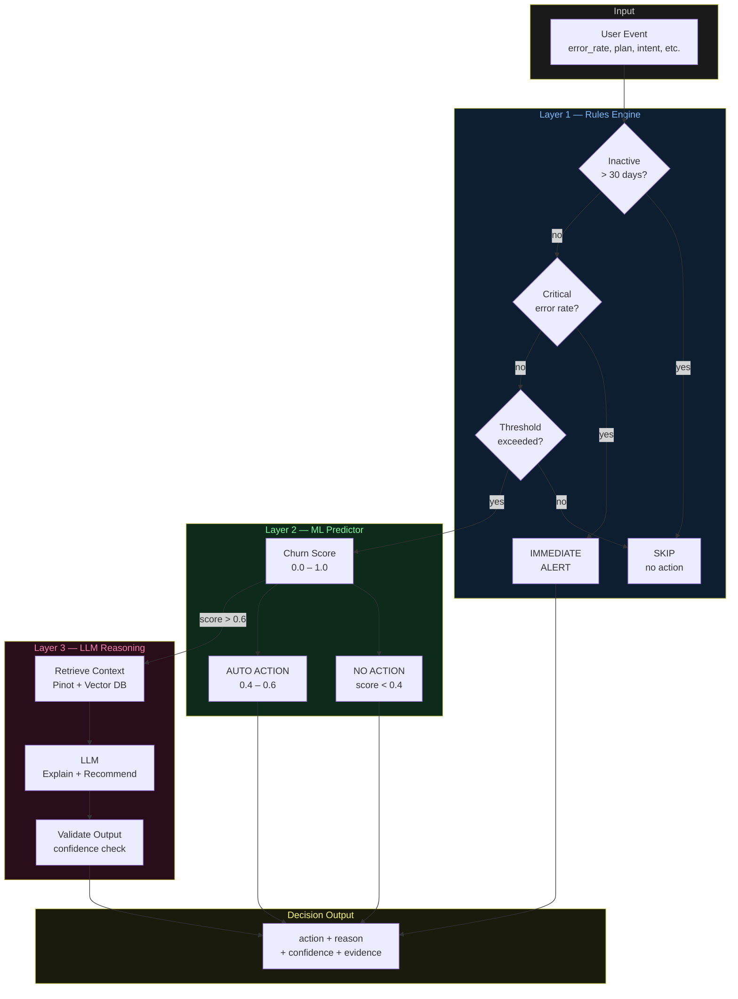

# Architecture Diagrams — Day 19: Decision Layer Design

---

## ASCII Diagram — Layered Decision Architecture

```
INPUT EVENT: user_id=u_4821, error_rate=0.80, plan=free, intent=0.82
                              │
                              ▼
╔══════════════════════════════════════════════════════════════════════════════╗
║  LAYER 1 — RULES ENGINE (deterministic, microseconds, free)                  ║
║                                                                              ║
║  Rule 1: inactive_check    → days_since_event > 30? NO → PASS               ║
║  Rule 2: critical_error    → error_rate >= 0.8?    YES → FAST TRACK         ║
║  Rule 3: plan_check        → plan == 'free'?       YES → flag                ║
║  Rule 4: data_validation   → all required fields?  YES → PASS               ║
║                                                                              ║
║  Result: FAST TRACK (critical_error_rate, confidence=1.0)                   ║
╚══════════════════════════════════════════════════════════════════════════════╝
                              │
                    ┌─────────┴─────────┐
                    │                   │
              FAST TRACK             PASS TO ML
                    │                   │
                    ▼                   ▼
           [IMMEDIATE ALERT]  ╔══════════════════════════════════════════════╗
                              ║  LAYER 2 — ML PREDICTOR (probabilistic, ~5ms)║
                              ║                                              ║
                              ║  Features:                                   ║
                              ║    error_rate:    0.80  (weight: 0.40)       ║
                              ║    intent_score:  0.82  (weight: 0.25)       ║
                              ║    plan=free:     1.0   (weight: 0.20)       ║
                              ║    days_signup:   45    (weight: 0.15)       ║
                              ║                                              ║
                              ║  churn_probability: 0.82                     ║
                              ║  confidence: 0.85                            ║
                              ║                                              ║
                              ║  Score >= 0.6 → ESCALATE TO LLM             ║
                              ╚══════════════════════════════════════════════╝
                                                │
                                    ┌───────────┴───────────┐
                                    │                       │
                               HIGH (>0.6)            LOW/MEDIUM
                                    │                       │
                                    ▼                       ▼
                    ╔═══════════════════════════╗   [AUTOMATED ACTION]
                    ║  LAYER 3 — LLM REASONING  ║   (send email, no LLM)
                    ║  (~500ms, per-token cost)  ║
                    ║                           ║
                    ║  Context:                 ║
                    ║  - Pinot metrics          ║
                    ║  - Vector DB events       ║
                    ║  - ML score               ║
                    ║                           ║
                    ║  Output:                  ║
                    ║  - Explanation            ║
                    ║  - Recommended action     ║
                    ║  - Confidence: 0.92       ║
                    ╚═══════════════════════════╝
                                    │
                                    ▼
╔══════════════════════════════════════════════════════════════════════════════╗
║  DECISION OUTPUT                                                             ║
║                                                                              ║
║  action:     escalate_checkout_fix                                           ║
║  reason:     "5 checkout errors (80% rate) blocking upgrade intent (0.82)"  ║
║  confidence: 0.78  (rules:1.0 × ml:0.85 × llm:0.92)                       ║
║  evidence:   ["5 errors", "clicked Upgrade to Pro", "support ticket"]       ║
║  layer_path: rules → ml → llm                                               ║
╚══════════════════════════════════════════════════════════════════════════════╝
```

---

## ASCII Diagram — LLM-Only vs Layered System

```
LLM-ONLY SYSTEM (50,000 users)
─────────────────────────────────────────────────────────────────────────────
All 50,000 users → LLM → decision

  Cost:    ~$25 (50,000 × $0.0005/call)
  Time:    ~14 hours (50,000 × 1s/call)
  Quality: Inconsistent (non-deterministic)
  Audit:   Hard (LLM reasoning is opaque)


LAYERED SYSTEM (50,000 users)
─────────────────────────────────────────────────────────────────────────────
50,000 users
    │
    ▼ Rules (microseconds, free)
    ├── 12,000 inactive → SKIP
    ├──    847 critical → IMMEDIATE ALERT
    └── 37,153 → ML
         │
         ▼ ML (5ms/user, ~$0.001 total)
         ├── 28,000 low risk → NO ACTION
         ├──  7,500 medium   → SEND EMAIL
         └──  1,653 high     → LLM
              │
              ▼ LLM (1s/user, ~$0.83 total)
              └── 1,653 → FULL EXPLANATION + ACTION

  Cost:    ~$0.83 (1,653 × $0.0005/call)
  Time:    ~30 min (1,653 × 1s/call, parallelized)
  Quality: High (LLM only sees pre-validated cases)
  Audit:   Full trace through all three layers

  Savings: 30x cheaper, 30x faster
```

---

## Mermaid Diagram — Layered Decision Architecture


