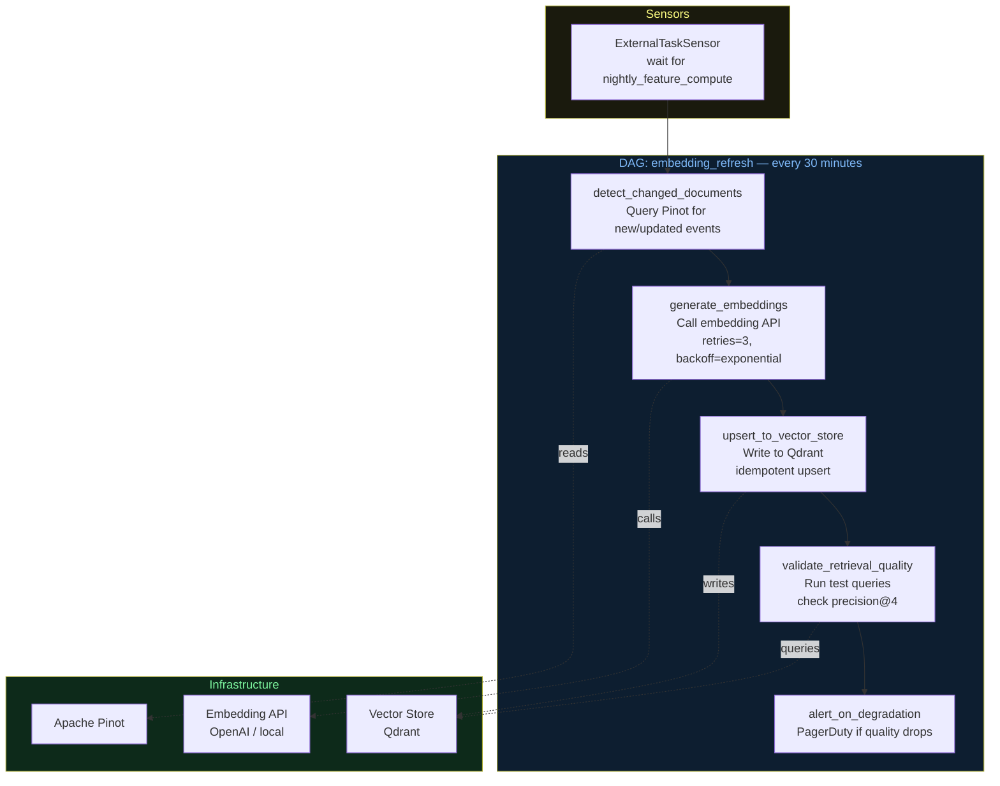
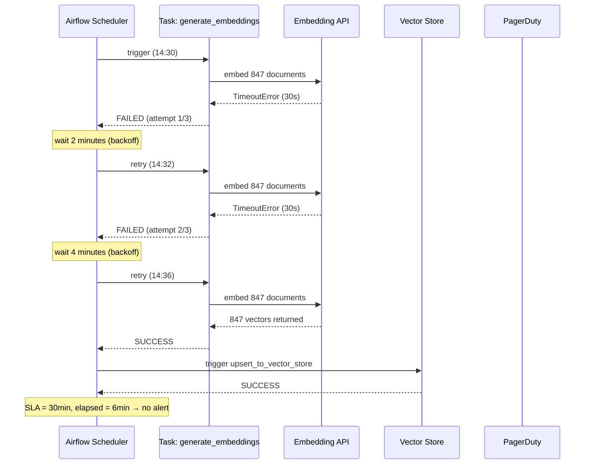

# Architecture Diagrams — Day 20: Airflow for AI Systems

---

## ASCII Diagram — Airflow Coordinating AI Workflows

```
╔══════════════════════════════════════════════════════════════════════════════╗
║  APACHE AIRFLOW — Orchestration Control Plane                                ║
║                                                                              ║
║  Scheduler: reads DAG definitions, triggers tasks on schedule               ║
║  Executor:  runs tasks (LocalExecutor / CeleryExecutor / KubernetesExecutor)║
║  Webserver: UI for monitoring, triggering, and debugging                    ║
║  Metadata DB: stores DAG run history, task states, logs                     ║
╚══════════════════════════════════════════════════════════════════════════════╝
         │                    │                    │                    │
         ▼                    ▼                    ▼                    ▼
╔══════════════╗  ╔══════════════════╗  ╔═══════════════╗  ╔══════════════════╗
║ DAG:         ║  ║ DAG:             ║  ║ DAG:          ║  ║ DAG:             ║
║ nightly_     ║  ║ embedding_       ║  ║ retrieval_    ║  ║ pinot_           ║
║ feature_     ║  ║ refresh          ║  ║ quality_      ║  ║ maintenance      ║
║ compute      ║  ║ (every 30min)    ║  ║ monitor       ║  ║ (weekly)         ║
║ (daily)      ║  ║                  ║  ║ (hourly)      ║  ║                  ║
║              ║  ║ ┌─────────────┐  ║  ║               ║  ║                  ║
║ ┌──────────┐ ║  ║ │detect_      │  ║  ║ ┌───────────┐ ║  ║ ┌──────────────┐║
║ │compute_  │ ║  ║ │changed_docs │  ║  ║ │run_test_  │ ║  ║ │compact_      ║║
║ │cohorts   │ ║  ║ └──────┬──────┘  ║  ║ │queries    │ ║  ║ │segments      ║║
║ └────┬─────┘ ║  ║        │         ║  ║ └─────┬─────┘ ║  ║ └──────┬───────┘║
║      │       ║  ║        ▼         ║  ║       │       ║  ║        │        ║
║ ┌────▼─────┐ ║  ║ ┌─────────────┐  ║  ║ ┌─────▼─────┐ ║  ║ ┌──────▼───────┐║
║ │update_   │ ║  ║ │generate_    │  ║  ║ │compute_   │ ║  ║ │rebuild_      ║║
║ │pinot_    │ ║  ║ │embeddings   │  ║  ║ │metrics    │ ║  ║ │indexes       ║║
║ │segments  │ ║  ║ │(retries=3)  │  ║  ║ └─────┬─────┘ ║  ║ └──────┬───────┘║
║ └────┬─────┘ ║  ║ └──────┬──────┘  ║  ║       │       ║  ║        │        ║
║      │       ║  ║        │         ║  ║ ┌─────▼─────┐ ║  ║ ┌──────▼───────┐║
║ ┌────▼─────┐ ║  ║        ▼         ║  ║ │alert_if_  │ ║  ║ │validate_     ║║
║ │validate_ │ ║  ║ ┌─────────────┐  ║  ║ │degraded   │ ║  ║ │performance   ║║
║ │freshness │ ║  ║ │upsert_to_   │  ║  ║ └───────────┘ ║  ║ └──────────────┘║
║ └──────────┘ ║  ║ │vector_store │  ║  ╚═══════════════╝  ╚══════════════════╝
╚══════════════╝  ║ └──────┬──────┘  ║
                  ║        │         ║
                  ║        ▼         ║
                  ║ ┌─────────────┐  ║
                  ║ │validate_    │  ║
                  ║ │retrieval_   │  ║
                  ║ │quality      │  ║
                  ║ └─────────────┘  ║
                  ╚══════════════════╝
         │                    │
         ▼                    ▼
╔══════════════╗  ╔══════════════════╗
║ Apache Pinot ║  ║ Vector Store     ║
║ (data store) ║  ║ (Qdrant/Pinecone)║
╚══════════════╝  ╚══════════════════╝
```

---

## ASCII Diagram — Task Retry Flow

```
TASK: generate_embeddings
─────────────────────────────────────────────────────────────────────────────

Attempt 1 (14:30:00):
  → Call OpenAI embedding API
  ← TimeoutError after 30s
  Status: FAILED
  Next retry in: 2 minutes (exponential backoff)

Attempt 2 (14:32:00):
  → Call OpenAI embedding API
  ← TimeoutError after 30s
  Status: FAILED
  Next retry in: 4 minutes

Attempt 3 (14:36:00):
  → Call OpenAI embedding API
  ← Success (847 embeddings generated)
  Status: SUCCESS
  Duration: 12.3s

Downstream task upsert_to_vector_store: STARTS (was waiting)

Total delay: 6 minutes
SLA: 30 minutes
Alert: NONE (completed within SLA)

─────────────────────────────────────────────────────────────────────────────

If all 3 retries fail:
  Status: FAILED (no more retries)
  on_failure_callback: fires → PagerDuty alert
  Downstream tasks: BLOCKED (will not run on stale data)
  Dead letter: failed doc IDs written to dead_letter table
```

---

## Mermaid Diagram — Embedding Refresh DAG



---

## Mermaid Diagram — Failure and Recovery Flow


