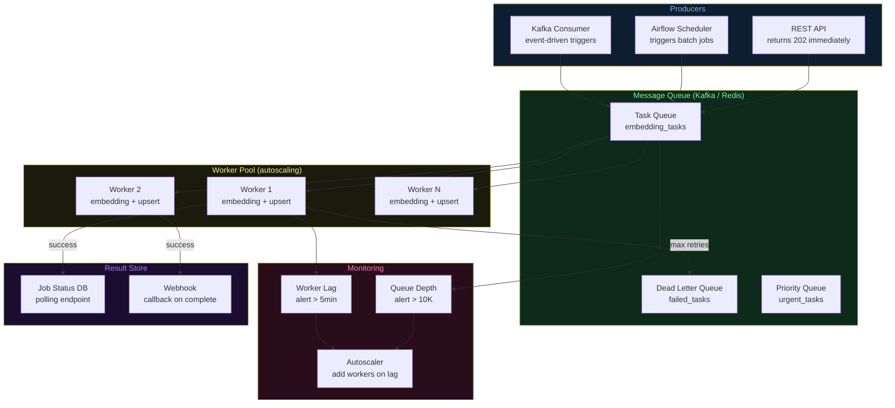

# Architecture Diagrams — Day 21: Async vs Sync Architectures

---

## ASCII Diagram — Sync vs Async Workflow

```
SYNCHRONOUS ARCHITECTURE
─────────────────────────────────────────────────────────────────────────────

Client                API                 Services
  │                    │                      │
  │── POST /analyze ──►│                      │
  │                    │── Query Pinot ───────►│ (70ms)
  │                    │◄─ results ────────────│
  │                    │── Search vectors ────►│ (50ms)
  │                    │◄─ chunks ─────────────│
  │                    │── Call LLM ──────────►│ (600ms)
  │                    │◄─ response ───────────│
  │◄── 200 OK ─────────│                      │
  │   (720ms total)    │                      │

Properties:
  ✅ Simple to implement
  ✅ Easy to debug
  ❌ Client blocks for 720ms
  ❌ Under 1000 req/sec: 720 concurrent threads needed
  ❌ One slow LLM call blocks everything behind it


ASYNCHRONOUS ARCHITECTURE
─────────────────────────────────────────────────────────────────────────────

Client                API              Queue           Workers
  │                    │                 │                │
  │── POST /analyze ──►│                 │                │
  │                    │── enqueue ─────►│                │
  │◄── 202 Accepted ───│                 │                │
  │   job_id=abc123    │                 │                │
  │   (50ms total)     │                 │                │
  │                    │                 │── task ───────►│ Worker 1
  │                    │                 │── task ───────►│ Worker 2
  │                    │                 │── task ───────►│ Worker 3
  │                    │                 │                │
  │── GET /jobs/abc123 ►│                │                │
  │◄── {status:running}│                │                │
  │                    │                 │                │ (processing...)
  │── GET /jobs/abc123 ►│                │                │
  │◄── {status:done}   │                │                │
  │   results_url=...  │                 │                │

Properties:
  ✅ Client gets immediate response (50ms)
  ✅ Workers scale independently
  ✅ Queue absorbs traffic spikes
  ✅ Failures are isolated and retryable
  ❌ More complex (job tracking, result delivery)
  ❌ Results not immediately available
```

---

## ASCII Diagram — Backpressure and Queue Buildup

```
NORMAL OPERATION (producer rate ≤ consumer rate)
─────────────────────────────────────────────────────────────────────────────

Producer: 800 tasks/sec ──► [Queue: 0-100 tasks] ──► Workers: 800 tasks/sec
                                    ↑
                              Queue stable

TRAFFIC SPIKE (producer rate > consumer rate)
─────────────────────────────────────────────────────────────────────────────

t=0s:   Producer: 2000 tasks/sec ──► [Queue: 0]     ──► Workers: 800 tasks/sec
t=10s:  Producer: 2000 tasks/sec ──► [Queue: 12,000] ──► Workers: 800 tasks/sec
t=30s:  Producer: 2000 tasks/sec ──► [Queue: 36,000] ──► Workers: 800 tasks/sec
                                           ↑
                                    ALERT: queue depth > 10,000
                                    ACTION: scale workers to 2000/sec

DOWNSTREAM SLOWDOWN (LLM API slow)
─────────────────────────────────────────────────────────────────────────────

Normal:   Worker processes task in 100ms → 10 tasks/sec/worker
LLM slow: Worker processes task in 800ms → 1.25 tasks/sec/worker

With 10 workers:
  Normal:   10 × 10 = 100 tasks/sec
  LLM slow: 10 × 1.25 = 12.5 tasks/sec

Queue growth rate: 800 - 12.5 = 787.5 tasks/sec
After 60 seconds: 47,250 tasks in queue

SYNC equivalent: all 10 threads blocked waiting for LLM
                 → 0 new requests can be processed
                 → clients see 100% timeout rate
```

---

## ASCII Diagram — Retry with Dead Letter Queue

```
RETRY FLOW
─────────────────────────────────────────────────────────────────────────────

Task arrives in queue
    │
    ▼
Worker picks up task
    │
    ▼
Execute task
    ├── SUCCESS → mark complete, remove from queue
    │
    └── FAILURE
            │
            ├── attempt < max_retries?
            │       │
            │       ├── YES → wait (exponential backoff + jitter)
            │       │         → re-enqueue with attempt+1
            │       │
            │       └── NO → move to Dead Letter Queue (DLQ)
            │                 → fire alert
            │                 → log for manual investigation
            │
            └── DLQ contents:
                  - Original task payload
                  - All error messages
                  - Attempt count
                  - Timestamps
                  → Can be replayed after root cause is fixed
```

---

## Mermaid Diagram — Queue-Based Architecture


