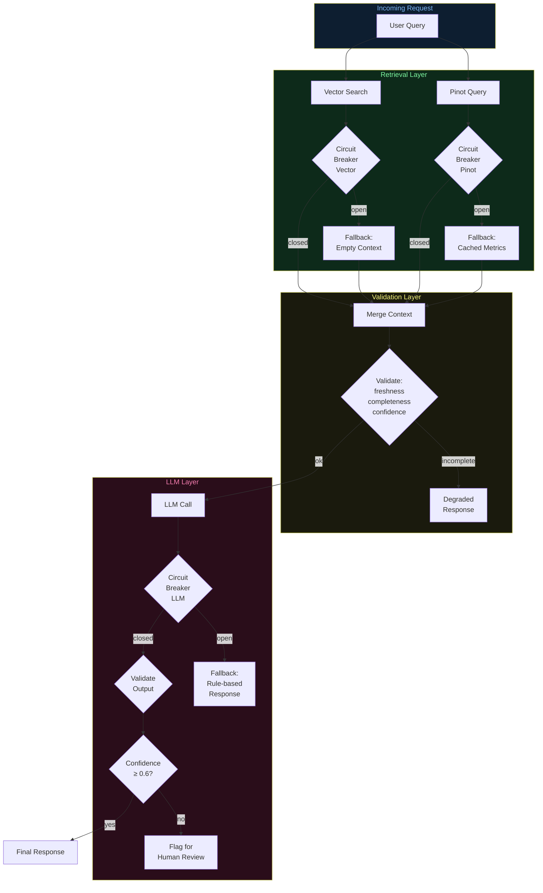

# Architecture Diagrams — Day 22: Failure Modes in AI Systems

---

## ASCII Diagram — Failure Propagation Through AI Stack

```
FAILURE PROPAGATION MAP
─────────────────────────────────────────────────────────────────────────────

LAYER 1: KAFKA (Streaming Backbone)
  ┌─────────────────────────────────────────────────────────────────────┐
  │ Failure: Consumer lag builds up (Flink falls behind)                │
  │ Symptom: Events not processed, no error thrown                      │
  │ Propagates to: Pinot data becomes stale                             │
  │ Detection: kafka_consumer_lag metric > threshold                    │
  └─────────────────────────────────────────────────────────────────────┘
                              │ propagates
                              ▼
LAYER 2: FLINK (Stream Processing)
  ┌─────────────────────────────────────────────────────────────────────┐
  │ Failure: Enrichment job crashes (OOM, checkpoint failure)           │
  │ Symptom: Raw events reach Pinot without plan/segment enrichment     │
  │ Propagates to: Pinot queries fail (missing columns)                 │
  │ Detection: Flink job health check, checkpoint failure alert         │
  └─────────────────────────────────────────────────────────────────────┘
                              │ propagates
                              ▼
LAYER 3: PINOT (Real-Time Analytics)
  ┌─────────────────────────────────────────────────────────────────────┐
  │ Failure: Broker restart, segment corruption, query timeout          │
  │ Symptom: SQL queries return empty result or error                   │
  │ Propagates to: Agent tool call returns empty → LLM assumes no data  │
  │ Detection: Pinot broker health, query error rate                    │
  └─────────────────────────────────────────────────────────────────────┘
                              │ propagates
                              ▼
LAYER 4: VECTOR STORE (Semantic Retrieval)
  ┌─────────────────────────────────────────────────────────────────────┐
  │ Failure: Stale index, collection unavailable, wrong embeddings      │
  │ Symptom: Returns empty results or wrong user's events               │
  │ Propagates to: LLM has no behavioral context → hallucinates         │
  │ Detection: Retrieval quality benchmark, embedding freshness monitor  │
  └─────────────────────────────────────────────────────────────────────┘
                              │ propagates
                              ▼
LAYER 5: LLM API (Reasoning)
  ┌─────────────────────────────────────────────────────────────────────┐
  │ Failure: Timeout, rate limit, model degradation                     │
  │ Symptom: No response, low-quality response, or retry storm          │
  │ Propagates to: Agent retries → cascade → or wrong answer returned   │
  │ Detection: LLM latency P99, error rate, confidence score histogram  │
  └─────────────────────────────────────────────────────────────────────┘
                              │ propagates
                              ▼
LAYER 6: AGENT / RESPONSE (Output)
  ┌─────────────────────────────────────────────────────────────────────┐
  │ Failure: Wrong tool selection, hallucinated conclusion              │
  │ Symptom: Confident-sounding wrong answer delivered to user          │
  │ Propagates to: Wrong business decision, user trust erosion          │
  │ Detection: Output validation, human feedback loop, A/B testing      │
  └─────────────────────────────────────────────────────────────────────┘


FAILURE SEVERITY MATRIX
─────────────────────────────────────────────────────────────────────────────

Failure Type          Detectability   Severity   Time to Detect
─────────────────────────────────────────────────────────────────────────────
Kafka consumer lag    EASY            MEDIUM     Minutes (metric alert)
Flink job crash       EASY            HIGH       Seconds (job health check)
Pinot broker down     EASY            HIGH       Seconds (health check)
Stale embeddings      HARD            HIGH       Hours-Days (quality drift)
Noisy retrieval       HARD            MEDIUM     Days-Weeks (user feedback)
LLM hallucination     HARD            HIGH       Days-Weeks (user feedback)
Silent degradation    VERY HARD       HIGH       Weeks-Months (A/B test)
─────────────────────────────────────────────────────────────────────────────
```

---

## ASCII Diagram — Circuit Breaker States

```
CIRCUIT BREAKER STATE MACHINE
─────────────────────────────────────────────────────────────────────────────

                    ┌─────────────────────────────────┐
                    │         CLOSED (normal)          │
                    │  Requests pass through           │
                    │  Success rate tracked            │
                    └──────────────┬──────────────────┘
                                   │
                    failure_rate > threshold
                    (e.g., 50% errors in 60s)
                                   │
                                   ▼
                    ┌─────────────────────────────────┐
                    │          OPEN (failing)          │
                    │  All requests → fallback         │
                    │  No calls to failing service     │
                    │  Timer: wait 30s before retry    │
                    └──────────────┬──────────────────┘
                                   │
                              timer expires
                                   │
                                   ▼
                    ┌─────────────────────────────────┐
                    │       HALF-OPEN (testing)        │
                    │  One test request allowed        │
                    │  Success → CLOSED                │
                    │  Failure → OPEN (reset timer)    │
                    └─────────────────────────────────┘

EXAMPLE: Pinot circuit breaker
  t=0:   Pinot broker restarts
  t=0-5s: 50% of queries fail → circuit opens
  t=5-35s: All queries → fallback (cached metrics)
  t=35s:  One test query → succeeds → circuit closes
  t=35s+: Normal operation resumes
```

---

## Mermaid Diagram — Reliability and Failure Flow


