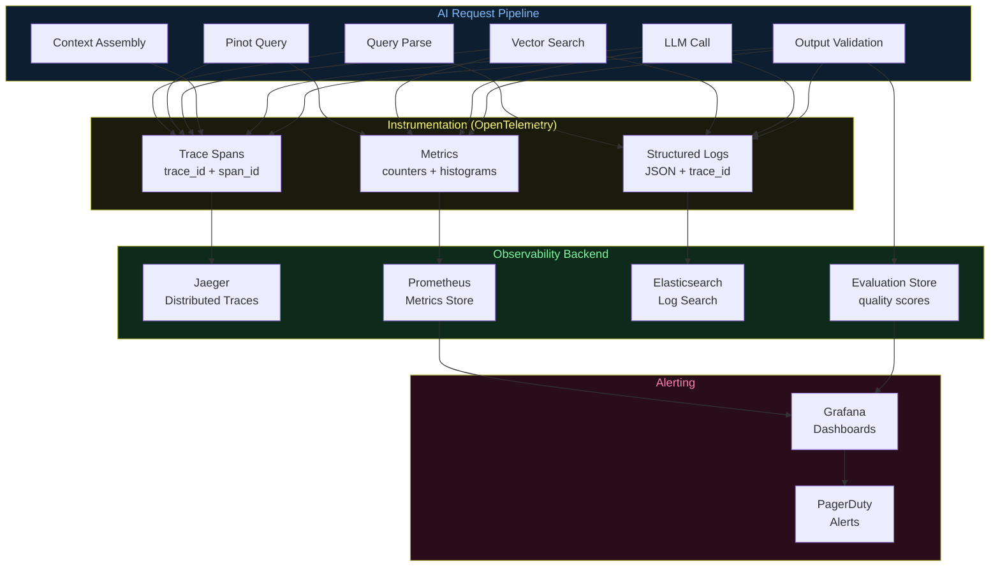

# Architecture Diagrams — Day 23: Observability for AI Systems

---

## ASCII Diagram — Observability Across AI Architecture

```
AI SYSTEM WITH FULL OBSERVABILITY
─────────────────────────────────────────────────────────────────────────────

REQUEST: "Why is user u_4821 at risk?"
    │
    │ trace_id=trace_a1b2c3
    ▼
╔══════════════════════════════════════════════════════════════════════════════╗
║  QUERY UNDERSTANDING                                                         ║
║  span: query_parse (5ms)                                                     ║
║  logs: {intent=churn, user_id=u_4821, ts=14:32:01}                         ║
╚══════════════════════════╤═══════════════════════════════════════════════════╝
                           │
              ┌────────────┴────────────┐
              ▼                         ▼
╔═════════════════════════╗   ╔══════════════════════════════════════════════╗
║  PINOT QUERY            ║   ║  VECTOR SEARCH                               ║
║  span: pinot_query(68ms)║   ║  span: vector_search(52ms)                   ║
║  metrics:               ║   ║  metrics:                                    ║
║    latency_ms=68        ║   ║    latency_ms=52                             ║
║    rows_returned=1      ║   ║    results_count=4                           ║
║    error=false          ║   ║    avg_score=0.87                            ║
║                         ║   ║    embedding_age_p99_s=45                    ║
║  logs: {sql=...,        ║   ║    stale_results=0                           ║
║    result={errors:5,    ║   ║                                              ║
║    churn:true}}         ║   ║  logs: {query=..., top_k=4,                  ║
╚═════════════════════════╝   ║    scores=[0.91,0.87,0.84,0.79]}            ║
                              ╚══════════════════════════════════════════════╝
              │                         │
              └────────────┬────────────┘
                           ▼
╔══════════════════════════════════════════════════════════════════════════════╗
║  CONTEXT ASSEMBLY                                                            ║
║  span: context_assembly(8ms)                                                 ║
║  metrics:                                                                    ║
║    context_tokens=284                                                        ║
║    chunks_selected=4                                                         ║
║    chunks_dropped=0                                                          ║
║    token_budget_used=71%                                                     ║
╚══════════════════════════╤═══════════════════════════════════════════════════╝
                           │
                           ▼
╔══════════════════════════════════════════════════════════════════════════════╗
║  LLM CALL                                                                    ║
║  span: llm_call(510ms)                                                       ║
║  metrics:                                                                    ║
║    latency_ms=510                                                            ║
║    input_tokens=284                                                          ║
║    output_tokens=87                                                          ║
║    cost_usd=0.00048                                                          ║
║    model=gpt-4o-mini                                                         ║
╚══════════════════════════╤═══════════════════════════════════════════════════╝
                           │
                           ▼
╔══════════════════════════════════════════════════════════════════════════════╗
║  OUTPUT VALIDATION                                                           ║
║  span: output_validation(7ms)                                                ║
║  metrics:                                                                    ║
║    confidence=0.92                                                           ║
║    grounding_score=1.0  (all cited facts in context)                        ║
║    hallucination_detected=false                                              ║
║    validation_passed=true                                                    ║
╚══════════════════════════════════════════════════════════════════════════════╝
                           │
                           ▼
╔══════════════════════════════════════════════════════════════════════════════╗
║  OBSERVABILITY BACKEND                                                       ║
║                                                                              ║
║  Traces → Jaeger / Zipkin / OpenTelemetry                                   ║
║  Metrics → Prometheus → Grafana dashboards                                  ║
║  Logs → Elasticsearch / Loki                                                ║
║  Evaluations → Custom evaluation store                                      ║
║  Alerts → PagerDuty / Slack                                                 ║
╚══════════════════════════════════════════════════════════════════════════════╝


ALERT THRESHOLDS
─────────────────────────────────────────────────────────────────────────────
Metric                          Warning     Critical    Action
─────────────────────────────────────────────────────────────────────────────
retrieval_precision_at_4        < 0.80      < 0.65      Re-run embedding refresh
avg_similarity_score            < 0.70      < 0.55      Check vector store health
hallucination_rate              > 0.05      > 0.15      Review context quality
llm_confidence_p10              < 0.65      < 0.50      Check retrieval quality
embedding_age_p99_s             > 3600      > 7200      Trigger embedding refresh
e2e_latency_p99_ms              > 1000      > 2000      Check component health
cost_per_query_usd              > 0.001     > 0.005     Check token usage
dag_success_rate                < 0.98      < 0.95      Check Airflow logs
─────────────────────────────────────────────────────────────────────────────
```

---

## Mermaid Diagram — Observability Data Flow


