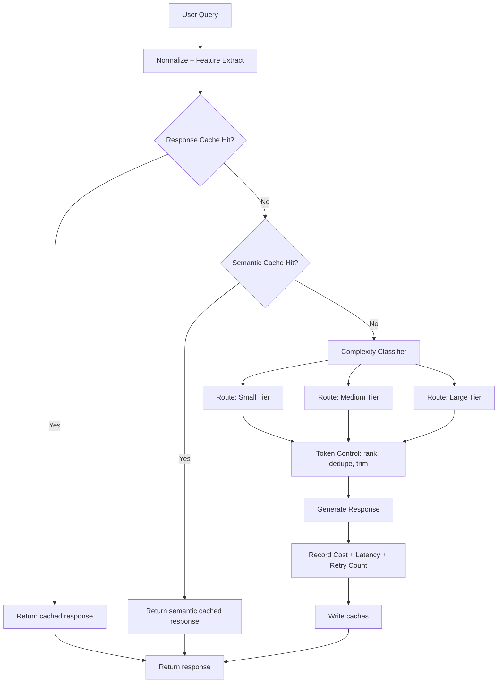

# Architecture Diagrams — Day 24: Cost Engineering for LLM Systems

## ASCII Diagram — Caching + Routing Architecture

```
                             ┌─────────────────────────────────────┐
    Incoming request ─────────▶        Request Normalizer          │
                             │ canonical key + intent features    │
                             └──────────────────┬──────────────────┘
                                                │
                                                ▼
                             ┌─────────────────────────────────────┐
                             │           Cache Gateway             │
                             │ 1) Response cache (exact match)    │
                             │ 2) Semantic cache (similar intent) │
                             └───────────────┬─────────────────────┘
                                             │ cache miss
                                             ▼
                             ┌─────────────────────────────────────┐
                             │     Complexity & Risk Classifier    │
                             │ size + ambiguity + SLA + criticality│
                             └───────────────┬─────────────────────┘
                                             │
                ┌────────────────────────────┼────────────────────────────┐
                ▼                            ▼                            ▼
    ┌─────────────────────┐      ┌─────────────────────┐      ┌─────────────────────┐
    │ Simple route        │      │ Standard route      │      │ Complex route       │
    │ top_k: shallow      │      │ top_k: medium       │      │ top_k: deep         │
    │ model tier: small   │      │ model tier: medium  │      │ model tier: large   │
    │ strict token budget │      │ balanced budget     │      │ quality-first budget │
    └──────────┬──────────┘      └──────────┬──────────┘      └──────────┬──────────┘
               └─────────────────────────────┼─────────────────────────────┘
                                             ▼
                             ┌─────────────────────────────────────┐
                             │       Token Optimization Layer      │
                             │ relevance filter + dedupe + trim    │
                             └──────────────────┬──────────────────┘
                                                ▼
                             ┌─────────────────────────────────────┐
                             │       LLM Invocation + Tracker      │
                             │ cost, latency, retries, loop count  │
                             └──────────────────┬──────────────────┘
                                                ▼
                             ┌─────────────────────────────────────┐
                             │      Cache write + Response         │
                             └─────────────────────────────────────┘
```

## Mermaid Diagram — Cost-Aware AI Workflow



## Mermaid Diagram — Cost Flow by Request Type

```mermaid
flowchart LR
    subgraph FAQ["FAQ Request (high volume)"]
        direction TB
        FQ[Query: \"What is churn score?\"] --> FC{Cache?}
        FC -->|Hit 72%| FR[Response: cached]
        FC -->|Miss| FS[Small model: <100 tokens]
        FS --> FO[Cost: ~$0.001/req]
    end

    subgraph ANALYSIS["Retention Analysis (low volume)"]
        direction TB
        AQ[Query: \"Why did retention drop?\"] --> AC{Cache?}
        AC -->|Hit 4%| AR[Response: cached]
        AC -->|Miss| AL[Large model: >2000 tokens]
        AL --> AO[Cost: ~$0.035/req]
    end

    FAQ -->|30-50x cheaper| COMPARE[Cost comparison]
    ANALYSIS -->|higher value per request| COMPARE
```

## Cost Comparison Table

| Layer | Optimized | Unoptimized | Impact |
|-------|-----------|-------------|--------|
| Caching | 3-5ms, $0 | 200-900ms, full cost | 90-98% cost reduction on hits |
| Model routing | Small for FAQ, large for analysis | Always large | 30-60% overall savings |
| Token control | Ranked, deduped, trimmed | Full context every time | 20-50% fewer tokens |
| Retrieval depth | Tuned per type | Fixed deep | 2-5x lower retrieval cost |
| Retry/loop control | Limited with budget guards | Unbounded | Prevents runaway cost |
