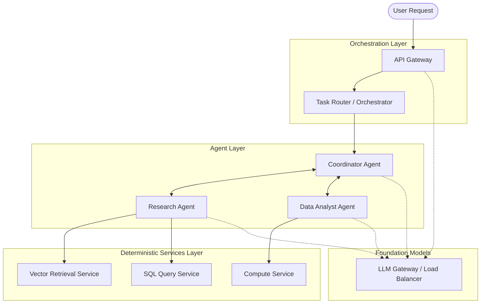

# Architecture Diagrams

## ASCII Diagram: Architectural Evolution

```text
[Monolithic AI]
User -> [ Routing + Retrieval + Generation + Tools ] -> User
(Hard to scale parts independently, single point of failure)

[Microservices AI]
          /-> [Retrieval Service]
User -> API -> [LLM Gateway Service] -> [Generation Service]
          \-> [Tool Execution Service]
(Scalable, deterministic, complex routing logic hardcoded)

[Multi-Agent System]
User -> [Coordinator Agent] <--> [Research Agent]
                           <--> [Analytics Agent]
(Adaptive, high coordination overhead, hard to trace)

[Hybrid Architecture]
User -> [Orchestrator / API Gateway]
             |
        [Agent Layer] (Adaptive Reasoning)
        /          \
 [Microservice A]  [Microservice B] (Deterministic Tools/Retrieval)
(Best of both worlds: bounded autonomy, scalable infrastructure)
```

## Mermaid Diagram: Layered AI Architecture


