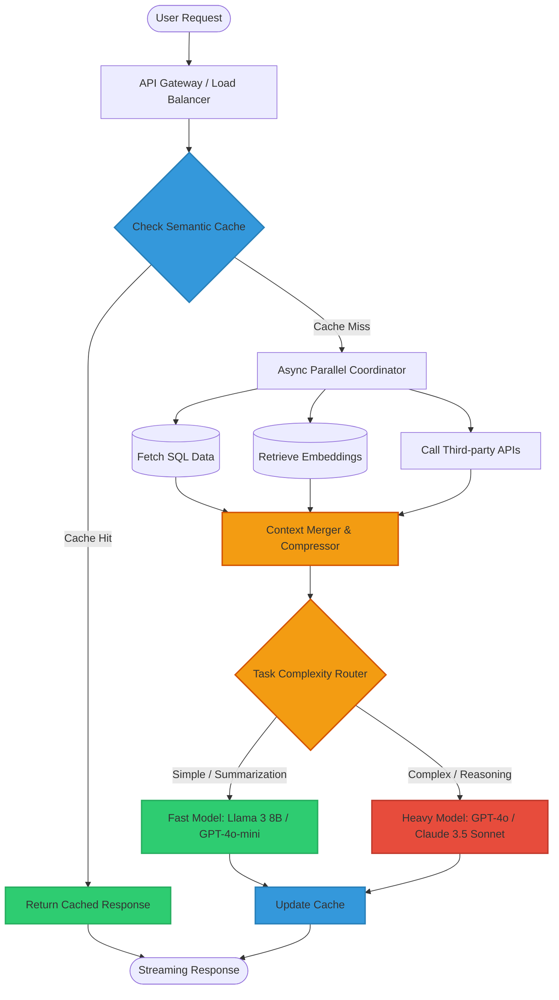

# Architecture Diagrams: Performance Optimization

## ASCII Diagram: Latency Across AI Architecture

```text
[User Request]
      │
      ▼
┌───────────────┐
│ Router / API  │ (10-50ms) -> High concurrency entry point
└───────┬───────┘
        │
        ├───────────────────────┐ [Cache Hit Path]
        │                       ▼
        │               ┌───────────────┐
        │               │ Semantic Cache│ (20-100ms)
        │               └───────┬───────┘
        │                       │
        ▼ [Cache Miss Path]     │
┌───────────────┐               │
│ Parallel Exec │               │
│ (Asyncio/Go)  │               │
└─┬─────┬─────┬─┘               │
  │     │     │                 │
  │     │     └───────────────┐ │
  ▼     ▼                     ▼ │
[DB]  [Vector DB]  [External API] (200-800ms pipeline latency)
  │     │                     │ │
  └─────┼─────────────────────┘ │
        ▼                       │
┌───────────────┐               │
│ Context Comp. │ (Summarizer/Reranker) (100-300ms)
└───────┬───────┘               │
        │                       │
        ▼                       │
┌───────────────┐               │
│ Model Router  │ (Classify task complexity) (50ms)
└───────┬───────┘               │
        │                       │
  ┌─────┴─────┐                 │
  ▼           ▼                 │
[Fast]      [Heavy]             │
[LLM]       [LLM]               │
(1-3s)      (10-30s)            │
  │           │                 │
  └─────┬─────┘                 │
        ▼                       │
[Streaming Response] <──────────┘
```

---

## Mermaid Diagram: Optimized AI Workflow


