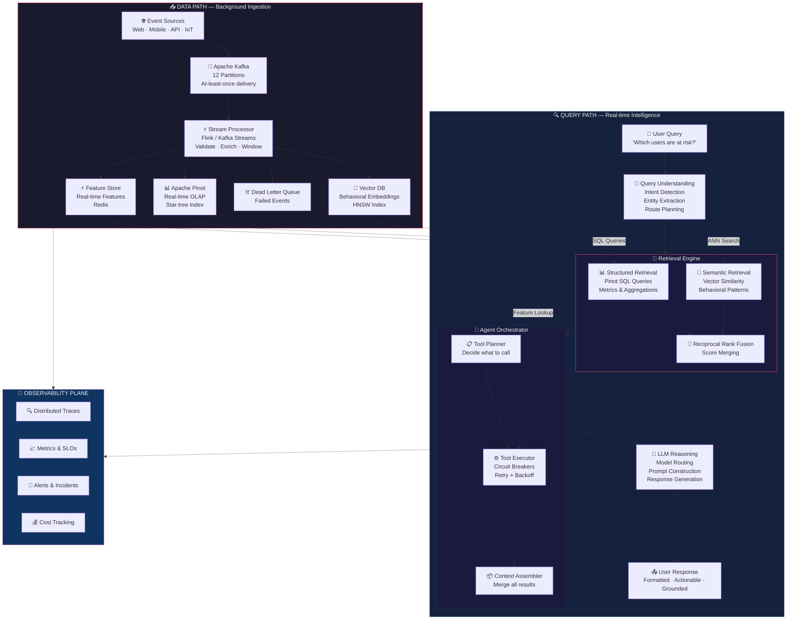
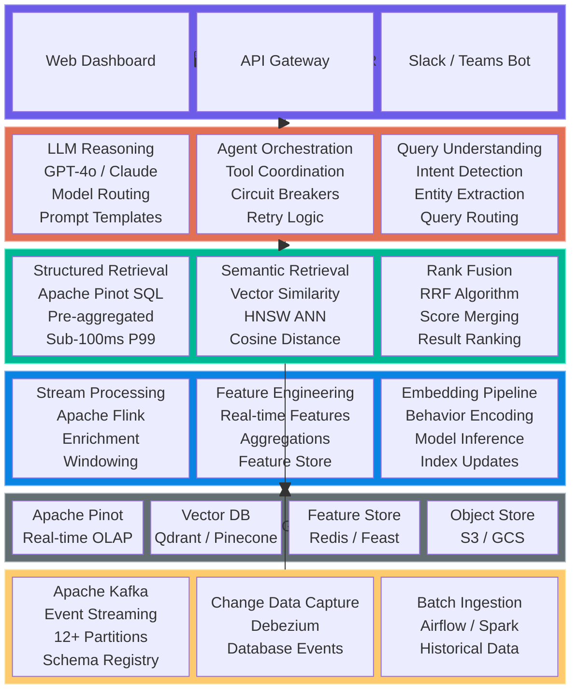
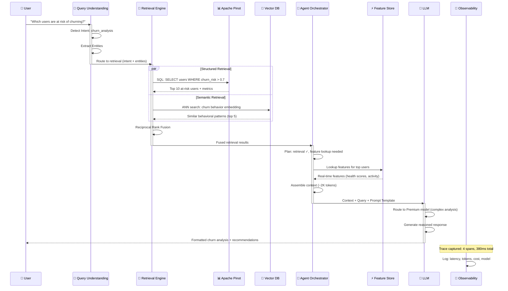

# Day 27 — Architecture Diagrams

## 1. ASCII Diagram — Complete End-to-End AI System

```
╔══════════════════════════════════════════════════════════════════════════════════════╗
║                        END-TO-END AI SYSTEM ARCHITECTURE                            ║
╠══════════════════════════════════════════════════════════════════════════════════════╣
║                                                                                      ║
║   ┌─────────────────────────── DATA PATH (Background) ──────────────────────────┐    ║
║   │                                                                              │    ║
║   │  ┌──────────────┐    ┌──────────────────┐    ┌────────────────────────────┐  │    ║
║   │  │   Event       │    │  Stream           │    │  Downstream Sinks          │  │    ║
║   │  │   Sources     │    │  Processor        │    │                            │  │    ║
║   │  │              │    │                    │    │  ┌──────────────────────┐  │  │    ║
║   │  │  Web App ──┐ │    │  ┌──────────────┐ │    │  │   Apache Pinot       │  │  │    ║
║   │  │  Mobile ──┤ │──▶│  │ Validate     │ │──▶│  │   (Real-time OLAP)   │  │  │    ║
║   │  │  API    ──┤ │    │  │ Enrich       │ │    │  └──────────────────────┘  │  │    ║
║   │  │  IoT    ──┘ │    │  │ Transform    │ │    │  ┌──────────────────────┐  │  │    ║
║   │  │              │    │  │ Window       │ │──▶│  │   Vector DB          │  │  │    ║
║   │  │  ┌────────┐ │    │  │ Route        │ │    │  │   (Embeddings)       │  │  │    ║
║   │  │  │ Kafka  │ │    │  └──────────────┘ │    │  └──────────────────────┘  │  │    ║
║   │  │  │ Topics │ │    │                    │    │  ┌──────────────────────┐  │  │    ║
║   │  │  │ (12    │ │    │  State: RocksDB   │──▶│  │   Feature Store      │  │  │    ║
║   │  │  │  part) │ │    │  Watermarks       │    │  │   (Redis)            │  │  │    ║
║   │  │  └────────┘ │    │  Exactly-once     │    │  └──────────────────────┘  │  │    ║
║   │  └──────────────┘    └──────────────────┘    └────────────────────────────┘  │    ║
║   └──────────────────────────────────────────────────────────────────────────────┘    ║
║                                                                                      ║
║   ┌─────────────────────────── QUERY PATH (Real-time) ──────────────────────────┐    ║
║   │                                                                              │    ║
║   │  ┌──────────┐   ┌───────────────┐   ┌──────────────┐   ┌────────────────┐   │    ║
║   │  │  User    │   │  Query         │   │  Retrieval   │   │  Agent          │   │    ║
║   │  │  Query   │──▶│  Understanding │──▶│  Engine      │──▶│  Orchestrator   │   │    ║
║   │  │          │   │               │   │              │   │                │   │    ║
║   │  │  NL text │   │  Intent ──────│   │  Structured ─│   │  Plan tools ──│   │    ║
║   │  │          │   │  Entities ────│   │  Semantic ───│   │  Execute ─────│   │    ║
║   │  │          │   │  Routing ─────│   │  RRF Fusion ─│   │  Retry ───────│   │    ║
║   │  │          │   │  Confidence ──│   │  Caching ────│   │  Fallback ────│   │    ║
║   │  └──────────┘   └───────────────┘   └──────────────┘   └───────┬────────┘   │    ║
║   │                                                                 │            │    ║
║   │                                                                 ▼            │    ║
║   │                                     ┌──────────────┐   ┌────────────────┐   │    ║
║   │                                     │  User        │   │  LLM           │   │    ║
║   │                                     │  Response    │◀──│  Reasoning     │   │    ║
║   │                                     │              │   │                │   │    ║
║   │                                     │  Formatted   │   │  Model Route ─│   │    ║
║   │                                     │  Actionable  │   │  Prompt Build ─│   │    ║
║   │                                     │  Grounded    │   │  Generate ────│   │    ║
║   │                                     │              │   │  Validate ────│   │    ║
║   │                                     └──────────────┘   └────────────────┘   │    ║
║   └──────────────────────────────────────────────────────────────────────────────┘    ║
║                                                                                      ║
║   ┌─────────────────────────── OBSERVABILITY PLANE ─────────────────────────────┐    ║
║   │                                                                              │    ║
║   │  ┌────────────┐  ┌────────────┐  ┌──────────────┐  ┌────────────────────┐   │    ║
║   │  │ Distributed│  │ Metrics    │  │ Circuit      │  │ Cost              │   │    ║
║   │  │ Tracing    │  │ Dashboard  │  │ Breakers     │  │ Tracking          │   │    ║
║   │  │            │  │            │  │              │  │                    │   │    ║
║   │  │ Trace ID   │  │ P50/P95/P99│  │ Per-tool     │  │ Token counts     │   │    ║
║   │  │ Spans      │  │ Throughput │  │ Failure rate │  │ Model costs      │   │    ║
║   │  │ Latency    │  │ Error rate │  │ Recovery     │  │ Budget alerts    │   │    ║
║   │  └────────────┘  └────────────┘  └──────────────┘  └────────────────────┘   │    ║
║   └──────────────────────────────────────────────────────────────────────────────┘    ║
║                                                                                      ║
╚══════════════════════════════════════════════════════════════════════════════════════╝
```

---

## 2. Mermaid Diagram — Distributed AI Architecture Flow



---

## 3. Layered Architecture Diagram



---

## 4. Data Flow Sequence


