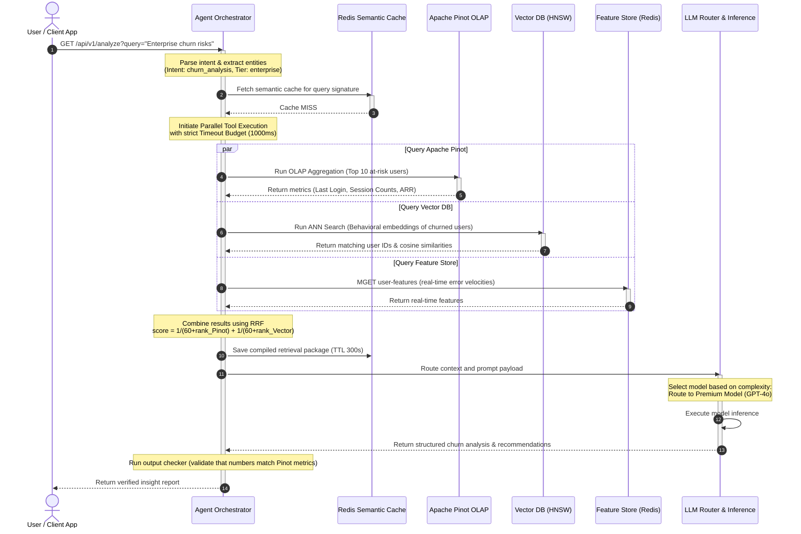
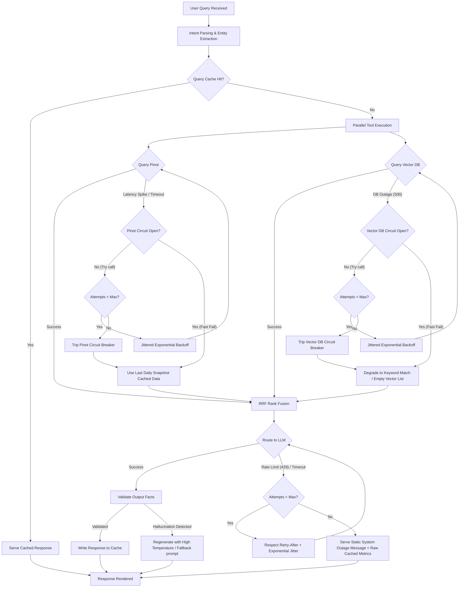

# Day 28: Architecture Diagrams — User Activity Intelligence Platform

This document hosts the architectural blueprints for the User Activity Intelligence Platform. It details the data flows, query pipelines, reliability structures, and observability layers that comprise a production-grade intelligent analytics platform.

---

## 1. ASCII System Architecture Diagram

Below is the complete end-to-end system architecture. Notice the separation of the asynchronous, high-throughput **Data Ingestion Path** (top) from the synchronous, low-latency **Query Reasoning Path** (bottom).

```
   ========================================================================================
                                     BACKGROUND DATA PATH
   ========================================================================================
   [App Clients]     [CRM Systems]     [Billing Services]
        │                 │                    │
        ▼                 ▼                    ▼
   ┌──────────────────────────────────────────────────────────────────────────────────────┐
   │                          KAFKA INGESTION BACKBONE (Broker)                           │
   │   Topic: user-events  (Partition Key: user_id)                                       │
   │   Partition 0 ──────► Partition 1 ──────► Partition 2 ──────► ... ──► Partition 11     │
   └───────────────────────────────────────────┬──────────────────────────────────────────┘
                                               │ (ordered consumption)
                                               ▼
   ┌──────────────────────────────────────────────────────────────────────────────────────┐
   │                          FLINK STREAM PROCESSING ENGINE                              │
   │  - Schema Validation ─────► [Reject Malformed Events] ──► Dead-Letter Queue (DLQ)    │
   │  - Profile Enrichment ────► Lookup DynamoDB/Redis (User Tier, Account Status)         │
   │  - Session Windowing ─────► 30-min Inactivity Gap Window Accumulators                │
   │  - Feature Generation ────► Activity Frequency, Error Velocity, Support Sentiment    │
   └───────┬───────────────────────────────────┬───────────────────────────────────┬──────┘
           │ (all events)                      │ (semantic events)                 │ (real-time metrics)
           ▼                                   ▼                                   ▼
   ┌───────────────┐                   ┌───────────────┐                   ┌───────────────┐
   │ APACHE PINOT  │                   │   VECTOR DB   │                   │ FEATURE STORE │
   │ (OLAP Table)  │                   │ (Behavioral)  │                   │    (Redis)    │
   │ Star-Tree Idx │                   │  HNSW Index   │                   │  Health Scores│
   └───────▲───────┘                   └───────▲───────┘                   └───────▲───────┘
           │                                   │                                   │
   ========================================================================================
                                    REAL-TIME QUERY PATH
   ========================================================================================
           │ (structured metrics)              │ (semantic profiles)               │ (real-time stats)
           └───────────────────────────┐       │       ┌───────────────────────────┘
                                       │       │       │
                                       ▼       ▼       ▼
   ┌──────────────────────────────────────────────────────────────────────────────────────┐
   │                                HYBRID RETRIEVAL LAYER                                 │
   │  - Reciprocal Rank Fusion (RRF): score = Σ 1 / (60 + rank_i)                          │
   │  - Semantic Query Caching: Redis TTL 300s (Matches incoming query embeddings)        │
   └───────────────────────────────────────────┬──────────────────────────────────────────┘
                                               │ (fused user profiles & context)
                                               ▼
   ┌──────────────────────────────────────────────────────────────────────────────────────┐
   │                            RESILIENT AGENT ORCHESTRATOR                              │
   │  - Dynamic Planner ─────► Tool Routing ─────► Parallel Dispatch (Pinot/Vector/Store) │
   │  - Safety Guards ───────► Timeout Budgets, Jittered Backoff, Circuit Breakers       │
   │  - Fallback Engine ─────► Graceful degradation using stale cache/averages           │
   └───────────────────────────────────────────┬──────────────────────────────────────────┘
                                               │ (grounded reasoning payload)
                                               ▼
   ┌──────────────────────────────────────────────────────────────────────────────────────┐
   │                              LLM REASONING INFRASTRUCTURE                            │
   │  - Router: Complex queries ──► Premium Model (GPT-4o) ──────┐                        │
   │           Simple queries   ──► Utility Model (GPT-4o-mini)  ├─► Token & Cost tracker │
   │  - Prompts: Version-controlled, structured templates        │                        │
   │  - Evaluator: Cross-checks answers with facts in context ───┘                        │
   └───────────────────────────────────────────┬──────────────────────────────────────────┘
                                               │ (validated response)
                                               ▼
                                      [User Dashboard / CLI]
```

---

## 2. Mermaid Sequence & Interaction Diagram

The diagram below represents the exact flow of events and control when a user submits an analytical query to analyze premium user behavior.



---

## 3. Failure Propagation & Resilience Flow Diagram

This diagram displays the system's response to infrastructure failures. If Pinot suffers a latency spike or the LLM rate-limits requests, the orchestrator prevents cascade failure using circuit breakers, jittered retries, and fallbacks.



---

## 4. Distributed Tracing & Observability Architecture

This diagram illustrates how distributed tracing contexts (Trace ID, Span ID) propagate across service boundaries to trace execution logic, aggregate metrics, and feed the evaluation pipeline.

```
   User Request (Injects Header: traceparent: 00-4bf92f3577b34da6a3ce929d0e0e4736-00f067aa0ba902b7-01)
     │
     ▼
   ┌─────────────────────────────────────────────────────────────────────────────┐
   │ Query Endpoint [Parent Span: query_execution]                               │
   │                                                                             │
   │   ├── Span: intent_classification (latency_ms: 15, status: OK)              │
   │   │                                                                         │
   │   ├── Span: query_caching_lookup (latency_ms: 5, status: CACHE_MISS)        │
   │   │                                                                         │
   │   ├── Span: parallel_retrieval (latency_ms: 220, status: DEGRADED)          │
   │   │     ├── child span: pinot_sql_query (latency_ms: 215, status: TIMEOUT)──┼──► Emit JSON Log
   │   │     └── child span: vector_ann_search (latency_ms: 35, status: OK)      │     {"trace_id":"4bf92...",
   │   │                                                                         │      "span_id":"00f06...",
   │   ├── Span: rrf_rank_fusion (latency_ms: 8, status: OK)                     │      "level":"ERROR",
   │   │                                                                         │      "msg":"Pinot query
   │   ├── Span: agent_orchestration (latency_ms: 450, status: OK)               │             timeout. Tripping
   │   │     └── child span: pinot_fallback_execution (latency_ms: 12, status: OK)│             circuit breaker"}
   │   │                                                                         │
   │   └── Span: llm_reasoning (latency_ms: 1250, status: OK) ───────────────────┼──► Metrics (Prometheus)
   │         │                                                                   │     - query_latency_seconds
   │         │ (Model: gpt-4o | Tokens: 3450 | Cost: $0.0125)                    │     - llm_token_costs_total
   │         └───────────────────────────────────────────────────────────────────┼──►  - circuit_breaker_trips
   └─────────────────────────────────────────────────────────────────────────────┘
                                        │
                                        ▼ (Context Export)
   ┌─────────────────────────────────────────────────────────────────────────────┐
   │                        EVALUATION PIPELINE (Offline / Async)                │
   │  Evaluates traces stored in DB using LLM-as-a-judge:                         │
   │  - Groundedness (does the response hallucinate beyond retrieved context?)   │
   │  - Context Recall (did retrieval miss critical user data?)                  │
   │  - Latency SLA violation alerts                                             │
   └─────────────────────────────────────────────────────────────────────────────┘
```
